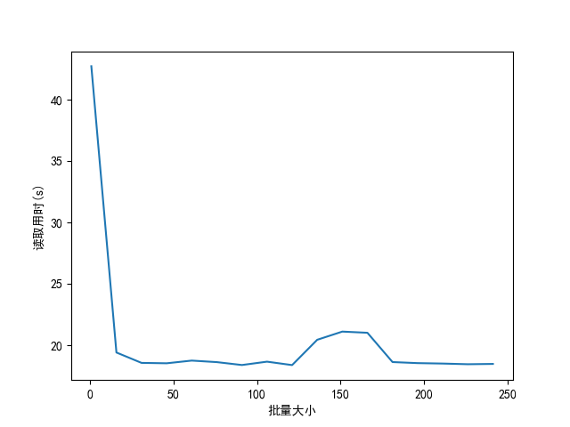

# 补充及纠错《动手学深度学习 第二版》

> 本文依据B站上的[【动手学深度学习v2】系列视频](https://space.bilibili.com/1567748478/lists/358497?type=series)和[AI论文精读系列视频](https://space.bilibili.com/1567748478/lists/32744?type=season)，从PyTorch的角度对[《动手学深度学习 第二版》](https://zh.d2l.ai)（以下简称为“本书网站”）的内容（包括英文版）进行补充和纠错，需要结合此二者进行学习，适用于熟练掌握Python、高等数学、线性代数和概率论的读者。

> [!TIP]
> 知识推荐查看Tully_Monster的[语雀文档](https://www.yuque.com/tully/d2l)，练习推荐查看scdifsn的[《动手学深度学习》笔记及练习详解](https://blog.csdn.net/scdifsn/category_12618902.html)。

## 预备知识

### 数据操作

1. 维度相关

    ​	RGB图像有长、宽和通道数共3维，一个RGB图片批量由于多了批量大小这一新维度，所以是4维，一个视频批量又多了时间，所以是5维。

> [!TIP|label:cat函数]
> 使用$torch.cat$函数连结张量时，两个张量中连结所沿轴对应维度的大小无要求，但其余维度的大小需对应一致。可以理解成由连结所沿轴对应维度前几级的维度决定要把第二个张量的对应元素放在第一个张量的哪个位置后面，所以前几级维度大小需对应一致；且放置后还是一个张量，即放过来的元素和该位置原有元素各维度大小对应一致，所以后几级维度大小也需对应一致。

2. 广播机制

    ​	利用广播机制得到的结果每个维度的大小等于所有参与计算的张量在该维度的最大大小，且对于结果的每个维度，所有参与计算的张量要么没有该维度，要么该维度的大小为1，要么该维度的大小和结果在该维度的大小一致。若此三者均不满足，则会因为不知道如何复制而报错，从而无法利用广播机制。

3. 索引和切片

    ​	可迭代对象（数组、张量和$range$函数的结果等）也可以被用作张量的索引从而得到切片，此时会将张量的每一维上的用作索引的可迭代对象的元素一一对应，并选取出元素数值对应的位置，若用作索引的可迭代对象是高于一维的，则得到的切片也是高于一维的且在最低一维对应用作索引的可迭代对象的元素数值。

### 数据预处理

1. 代码补充

    ​	使用$iloc$属性选出$data$的前两列后，由于第二列的数据是字符串，无法取平均值，所以使用$mean$函数时应传入一个参数`numeric_only=True`。

    ​	使用$values$属性得到对应的NumPy数组。使用$pd.get\_dummies$函数对原数据进行独热编码（将一个离散特征转化为多个二元特征），得到新的列的数据默认为`True`或`False`，这并非数值，所以得到对应的NumPy数组后无法转化为张量，还应给$pd.get\_dummies$函数传入一个参数`dtype=type(0)`，这样得到新的列的数据为`1`或`0`，可以直接转化为张量。

> [!TIP|label:view函数和replace函数]
> 步幅被用于表示在每个维度上移动到下一元素需要经过的内存距离。张量的连续性指逻辑上相邻的元素在内存中是否连续存储，是则连续，反之不连续，可以调用$is\_contiguous$函数判断某个张量是否连续。
>
> $view$函数执行后不会开一段新的内存，只是改变步幅，所以它的执行条件是可以用一个新的步幅来访问之前的内存从而得到想要的逻辑结果。所以对于连续的张量，$view$函数一定可以执行；对于不连续的张量，若满足条件也可以执行。
>
> 当满足$view$函数的条件时，$replace$函数与其结果一致，反之会开一段新的内存以得到想要的逻辑结果。
> 所以，当满足$view$函数的条件时，$view$函数和$replace$函数都不会改变张量的连续性。
>
> 当$view$函数或$replace$函数的参数中某一维度大小为`-1`时，该维度大小自动计算，若不能整除则报错从而无法执行。

2. 删除缺失值最多的列

    ​	使用$isnull$函数得到一个表示原数据在每个位置是否为空的$DataFrame$类的实例，使用$sum$函数得到每一列的和，使用$idxmax$函数得到最大值的索引（有多个则为第一个）。

    ​	依次使用以上三个函数，则$sum$函数得到的结果为每一列有多少空值，$idxmax$函数得到的结果为空值最多的一列的索引，再使用$drop$函数根据索引删除对应的数据，代码如下：

    ```Python
    max_nan_column = data.isnull().sum().idxmax()
    data.drop(max_nan_column, axis=1, inplace=True)
    print(data)
    ```

    ​	其中`axis=1`表示要根据序号为1的维度的索引删除数据，此处为列；`inplace=True`表示直接对原数据进行修改。

### 线性代数

1. 降维

    ​	指定维度降维时，会通过依赖该维度来区分位置的那几组数分别得到几个数，然后将该维度去除并从低到高重新编排（比如一个矩阵按列降维后会得到一个行向量而不是列向量）。传入参数`keepdims=True`时，该维度不会被去除，但是大小变为1。

2. 练习

    - 将一个多维张量传入`len`函数，得到的结果是它的最高维度的大小；
    - 运行`A/A.sum(axis=1)`会报错从而无法执行，因为`A.sum(axis=1)`的结果是一个5列的张量，而A是一个5行4列的张量，无法利用广播机制；
    - 一个具有形状(2, 3, 4)的张量，在轴0、1和2上的求和输出形状分别为3行4列、2行4列和2行3列；
    - 将任意形状的张量传入$torch.norm$函数，得到的结果都是该张量所有元素的平方和的平方根。

### 微积分

1. 亚导数

    ​	在函数不可微处可以定义亚导数，用于表示此处导数的范围，比如$\frac{\partial |x|}{\partial x} = \left \{ \begin{matrix} 1 & x > 0 \\ -1 & x < 0 \\ a, a \in [-1, 1] & x = 0 \end{matrix} \right.$。

2. 梯度

    ​	梯度本质上就是因变量的每个元素相对于自变量的每个元素的偏导。

    ​	在分子布局中，$\frac{\partial y}{\partial \mathbf x}, \frac{\partial \mathbf y}{\partial x}$分别为行、列向量；在分母布局中，$\frac{\partial y}{\partial \mathbf x}, \frac{\partial \mathbf y}{\partial x}$分别为列、行向量。即什么布局，什么就不转置，另一个就转置，而后梯度形状是二者形状相乘。一般常用分子布局，本书网站用的是分母布局。

    ​	$\frac{\partial \mathbf y}{\partial \mathbf x} = \begin{bmatrix} \frac{\partial y_1}{\partial \mathbf x} \\ \frac{\partial y_2}{\partial \mathbf x}  \\ \vdots \\ \frac{\partial y_m}{\partial \mathbf x} \end{bmatrix} = \begin{bmatrix} \frac{\partial y_1}{\partial x_1} & \frac{\partial y_1}{\partial x_2} & \cdots & \frac{\partial y_1}{\partial x_n} \\ \frac{\partial y_2}{\partial x_1} & \frac{\partial y_2}{\partial x_2} & \cdots & \frac{\partial y_2}{\partial x_n} \\ \vdots & \vdots & \vdots & \vdots \\ \frac{\partial y_m}{\partial x_1} & \frac{\partial y_m}{\partial x_2} & \cdots & \frac{\partial y_m}{\partial x_n} \end{bmatrix}$，这也是分子布局。

    ​	使用分子布局时有以下性质：

    - $\frac{\partial a}{\partial \mathbf x} = \mathbf 0^T, \frac{\partial (sum(\mathbf x))}{\partial \mathbf x} = \mathbf 1^T, \frac{\partial |x|^2}{\partial \mathbf x} = 2 \mathbf x^T, \frac{\partial (\mathbf u^T \mathbf v)}{\partial \mathbf x} = \mathbf u^T \frac{\partial \mathbf v}{\partial \mathbf x} + \mathbf v^T \frac{\partial \mathbf u}{\partial \mathbf x}$；

    - $\frac{\partial \mathbf a}{\partial \mathbf x} = \mathbf O, \frac{\partial \mathbf x}{\partial \mathbf x} = \mathbf I, \frac{\partial (\mathbf A \mathbf x)}{\partial \mathbf x} = \mathbf A, \frac{\partial (\mathbf x^T \mathbf A)}{\partial \mathbf x} = \mathbf A^T, \frac{\partial (\mathbf A \mathbf u)}{\partial \mathbf x} = \mathbf A \frac{\partial \mathbf u}{\partial \mathbf x}$。

    ​	自变量和因变量都可以是矩阵或其它更高维的张量。

3. 代码说明

    ​	若不使用Jupyter，则$use\_svg\_display$函数无效，不需要编写相关代码，但是需要在$plot$函数最后添加一行代码——`plt.show()`，否则不会显示图像。不过需要注意，使用该函数会阻塞程序的执行，直到关闭图形窗口后才会继续执行，所以还是更建议放在所有代码之后。在Matplotlib图像中可以使用`$$`包含LaTex公式从而渲染LaTex排版。

    ​	使用pyplot中的大部分绘图函数时，会自动将张量参数的数据类型转换为numpy数组。

### 自动微分

1. 反向累积

    ​	计算图就是用于表示由自变量得到因变量的过程的一个无环图，其中根节点和叶子节点分别为因变量和自变量，其它节点则是由自变量计算得到的中间结果，可以称为结果节点。

    ​	对于$\frac{\partial y}{\partial x} = \frac{\partial y}{\partial u_n} \frac{\partial u_n}{\partial u_{n-1}} \cdots \frac{\partial u_2}{\partial u_1} \frac{\partial u_1}{\partial x}$，正向累积为$\frac{\partial y}{\partial x} = \frac{\partial y}{\partial u_n} (\frac{\partial u_n}{\partial u_{n-1}} (\cdots (\frac{\partial u_2}{\partial u_1} \frac{\partial u_1}{\partial x})))$，即先计算靠近自变量的层；反向累积（反向传递）为$\frac{\partial y}{\partial x} = (((\frac{\partial y}{\partial u_n} \frac{\partial u_n}{\partial u_{n-1}}) \cdots) \frac{\partial u_2}{\partial u_1}) \frac{\partial u_1}{\partial x}$，即先计算靠近因变量的层。

    ​	反向累积的过程大致为：①构造计算图；②正向执行计算图并储存中间结果；③反向执行计算图并剪枝；④得到求导结果。

    ​	反向累积和正向累积的时间复杂度都是$O(n)$，n表示操作子的个数，反向累积的空间复杂度也是$O(n)$，正向累积的空间复杂度是$O(1)$，但正向累积每次都要重新扫描一遍，而反向累积可以利用之前扫描的结果。

2. $backward$函数原理

    ​	当输出$y$时可以发现，$y$有一个$grad\_fn$属性，该属性记录了梯度函数的类型，叶子节点该属性的值通常为`None`，只有结果节点该属性的值才有效。

    ​	存有梯度的张量（定义时传入了参数`requires_grad=True`）无法直接转化为Numpy数组，但对其使用$detach$函数的结果可以转化为Numpy数组。

    ​	通过$backward$函数在自变量张量的$grad$属性上累加的是因变量相对自变量各个元素在当前值附近的导数值。

    ​	当计算非标量张量的梯度时，需要给$backward$函数传入一个`grad_tensors`参数，该参数是一个和因变量张量形状一致的张量，用于和因变量张量对位相乘，再将所有相乘结果相加，而执行$backward$函数后，自变量张量的$grad$属性就会按每个元素分别累加上这个相加结果关于每个元素的梯度。可以把这个参数理解成对因变量每个元素的加权。

    ​	使用$backward$函数后会销毁相关的计算图，所以对同一张量连续执行两次$backward$函数会报错从而无法执行。若想要不销毁，则需要传入参数`retain_graph=True`或`create_graph=True`，且后者还会添加一个求导计算图用于求高阶导数。

    ​	想要使用$backward$函数求二阶导数，需要先使用传入了参数`create_graph=True`的$backward$函数求一阶导数；再定义一个张量，值为对自变量张量的$grad$属性使用$clone$函数得到的结果（因为会累积梯度但又要储存一阶导数）；最后清空自变量张量的$grad$属性并对新定义的张量使用$backward$函数，这样就可以在自变量张量的$grad$属性中得到相对各个元素的二阶导数。以在$y = x^2$的$x = 2.0$处求二阶导数为例，代码如下：

    ```python
    i = torch.tensor(2.0, requires_grad=True)
    j = i ** 2
    j.backward(create_graph=True)
    first = i.grad.clone()
    i.grad.zero_()
    first.backward()
    print(i.grad)
    ```

    ​	这样就会得到输出`tensor(2., grad_fn=<ZeroBackward0>)`，以及一段推荐使用`autograd.grad`函数的警告。

> [!TIP|label:clone函数和detach函数]
> $clone$函数开一段新的内存来储存一个和原张量完全相同的新张量；$detach$函数使用之前的内存，但会脱离计算图，不参与梯度计算。

### 概率

1. 练习

    - $\max(P(\mathcal{A}), P(\mathcal{B})) \le P(\mathcal{A} \cup \mathcal{B}) \le P(\mathcal{A}) + P(\mathcal{B}), 0 \le P(\mathcal{A} \cap \mathcal{B}) \le \min(P(\mathcal{A}), P(\mathcal{B}))$；
    - 对于随机变量$A, B, C$，若$B$只依赖于$A$且$C$只依赖于$B$，则$P(A, B, C) = P(A) P(B|A) P(C|B)$；
    - 若运行第一个测试两次，则两次阳性的情况下患病的概率为$93.76\%$，而更准确的测试需要的成本一般更高，但效果的提升却没有那么大，且使用同一测试两次可能因相同原因使测试结果出错，从而导致两次的测试结果不独立，准确率下降。

## 线性神经网络

### 线性回归

1. 学习率和批量大小

    ​	学习率过小时，需要很多次迭代才能到达最低点；学习率过大时，会一次迭代跨过最低点从而导致在最低点附近振荡。
    
    ​	批量大小过小时，每次计算量太小，不适合并行来最大利用计算资源，但是一般会得到比较好的训练结果；批量大小过大时，内存消耗增加。减小批量大小可以降低使用的显存。

> [!NOTE]
> 本书网站及本文中使用`log`表示`ln`。

2. 推导使用平方误差的线性回归优化问题的解析解，什么时候可能比使用随机梯度下降更好？这种方法何时会失效？

    ​	设$\mathbf{x^{(i)}} = \begin{bmatrix} x_1^{(i)} & x_2^{(i)} & \cdots & x_d^{(i)} & 1 \end{bmatrix}^T, \mathbf X = \begin{bmatrix} \mathbf{x^{(1)}}^T \\ \mathbf{x^{(2)}}^T \\ \vdots \\ \mathbf{x^{(n)}}^T \end{bmatrix}, \mathbf w = \begin{bmatrix} w_1 \\ w_2 \\ \vdots \\ w_d \\ b \end{bmatrix}, \mathbf y = \begin{bmatrix} y^{(1)} \\ y^{(2)} \\ \vdots \\ y^{(n)} \end{bmatrix}, \mathbf{\hat{y}} = \mathbf X \mathbf w$，且损失均值$L = \frac1n \sum_{i = 1}^n \frac12 (y^{(i)} - \mathbf{x^{(i)}}^T \mathbf w)^2$。

    ​	用$\mathbf{x_i}$表示$\mathbf X$的第$i$列，则
    $$
    \frac{\partial L}{\partial w_1} = \frac{1}{2n} \sum_{i = 1}^n 2(y^{(i)} - \mathbf{x^{(i)}}^T \mathbf w)(-x_1^{(i)}) = -\frac{1}{n} (\mathbf y - \mathbf X \mathbf w)^T \mathbf{x_1}
    $$
    ​	同理可得$\frac{\partial L}{\partial w_2}, \cdots, \frac{\partial L}{\partial w_d}, \frac{\partial L}{\partial b}$，所以
    $$
    \frac{\partial L}{\partial \mathbf w} = -\frac{1}{n} (\mathbf y - \mathbf X \mathbf w)^T \mathbf X
    $$
    ​	满足$\frac{\partial L}{\partial \mathbf w} = \mathbf 0^T$的$\mathbf w$为解析解，即
    $$
    (\mathbf y - \mathbf X \mathbf w)^T \mathbf X = \mathbf 0^T
    $$
    ​	所以
    $$
    \mathbf y^T \mathbf X = \mathbf w^T \mathbf X^T \mathbf X
    $$
    ​	若$\mathbf X^T \mathbf X$可逆，即$\mathbf X$列满秩，则$\mathbf y^T \mathbf X (\mathbf X^T \mathbf X)^{-1} = \mathbf w^T$，此时解析解$\mathbf w^* = (\mathbf X^T \mathbf X)^{-1} \mathbf X^T \mathbf y$；若$\mathbf X^T \mathbf X$不可逆，即$\mathbf X$非列满秩，则无解析解，此方法失效。

    ​	所以当数据集较小、$\mathbf X$列满秩且不需要实时更新数据集时，该方法比使用随机梯度下降更好。

3. 假定控制附加噪声$\epsilon$的噪声模型是指数分布，即$p(\epsilon) = \frac12 \exp(-|\epsilon|)$。写出模型$-\log P(\mathbf y|\mathbf X)$下数据的负对数似然；请试着写出解析解；提出一种随机梯度下降算法来解决这个问题并指出哪里可能出错？（提示：当不断更新参数时，在驻点附近会发生什么情况？）

    ​	先将$b$放入$\mathbf w$，再在$\mathbf X$最右侧加一列$1$。

    ​	因为
    $$
    P(y|\mathbf x) = \frac 1 2 \exp(-|y - \mathbf x^T \mathbf w|), P(\mathbf y|\mathbf X) = \prod_{i = 1}^n P(y^{(i)}|\mathbf{x^{(i)}})
    $$
    ​	所以
    $$
    -\log P(\mathbf y|\mathbf X) = \sum_{i = 1}^n \log 2 + |y^{(i)} - \mathbf{x^{(i)}}^T \mathbf w|
    $$
    ​	因此，使$\sum_{i = 1}^n |y^{(i)} - \mathbf{x^{(i)}}^T \mathbf w|$值最小的$\mathbf w$即为解析解。虽然该式子为绝对值之和，无法求解析解，但是该式子的最小值一定不会小于$0$。所以若存在$\mathbf w$使得$\sum_{i = 1}^n |y^{(i)} - \mathbf{x^{(i)}}^T \mathbf w| = 0$，即$\mathbf y = \mathbf X \mathbf w$，则该$\mathbf w$可以被认为是解析解，而存在该解析解的条件是$\mathbf y$属于$\mathbf X$的列空间。

    ​	所以，若$\mathbf y$属于$\mathbf X$的列空间，则可消元求得解析解；反之，则不可求得解析解。

    ​	设随机梯度下降的更新公式为
    $$
    \mathbf w \leftarrow \mathbf w - \frac{\eta}{|\mathcal B|} \sum_{i \in \mathcal B} \frac{\partial |y^{(i)} - \mathbf{x^{(i)}}^T \mathbf w|}{\partial \mathbf w}
    $$
    ​	其中有
    $$
    \frac{\partial |y^{(i)} - \mathbf{x^{(i)}}^T \mathbf w|}{\partial \mathbf w} = \left \{ \begin{matrix} \mathbf{x^{(i)}}^T & |y^{(i)} - \mathbf{x^{(i)}}^T \mathbf w| < 0 \\ -\mathbf{x^{(i)}}^T & |y^{(i)} - \mathbf{x^{(i)}}^T \mathbf w| > 0 \end{matrix} \right.
    $$
    ​	所以
    $$
    \mathbf w \leftarrow \mathbf w - \frac{\eta}{|\mathcal B|} \mathrm{sgn}(\mathbf X \mathbf w - \mathbf y)^T \mathbf X
    $$
    ​	因为使用了绝对值函数作为损失函数，所以梯度在驻点附近存在突变，不会平滑地趋向$0$，可能导致模型无法稳定收敛。可以使用更加平滑的损失函数，比如Huber损失函数，该函数在误差较小时表现为平方损失，误差较大时表现为线性损失。

### 线性回归的从零开始实现

> [!TIP|label:normal函数]
> 使用$torch.normal$函数得到一个数据符合正态分布的张量，它的参数为正态分布的均值、标准差和张量的形状。

> [!TIP|label:matmul函数]
> 使用$torch.matmul$函数得到两个张量的矩阵乘法结果，与$torch.mm$函数和$torch.mv$函数不同的是，该函数可以计算二维以上的张量的矩阵乘法。

1. 代码说明

    ​	在`with torch.no_grad()`块中的操作不参与梯度计算。

2. 练习

    - 将权重初始化为0时算法仍然有效；
    - 在$squared_loss$函数中使用$reshape$函数的目的是防止计算平方误差的双方一个是列向量、另一个是行向量，但是在本例中双方都一定是列向量，所以其实无需使用；
    - 如果样本个数不能被批量大小整除，$data\_iter$函数因为有`min(i + batch_size, num_examples)`，所以不会受到什么影响，只是最后一个批量的大小比之前的更小，但是因为传入$sgd$函数的$batch\_size$参数是不变的，即偏大，所以更新参数的程度会偏小。

### 线性回归的简洁实现

1. 代码说明

    ​	本例中虽然使用了一个固定的$data\_iter$，但是只要定义时传入了参数`shuffle=True`，在每个$epoch$中完全遍历过一遍后就会重新打乱数据集的顺序并再次分割批量，这也就做到了和“线性回归的从零开始实现”一致。

    ​	比较线性回归的从零开始实现和简洁实现可以发现，后者随着$epoch$的增加，$loss$趋于的值大致为前者的两倍，这是因为后者计算$loss$时直接采用了均方差，而前者在均方差的基础上还除以了2；还可以发现，后者第一个$epoch$后的$loss$远小于前者，这是因为更新参数时需要依据选取出的小批量的$loss$，而后者的这个$loss$没有除以2，相当于学习率翻了倍，所以训练前期会收敛得更快一些。

2. 练习

    - 若将小批量损失的平均值换为总和，则相当于将学习率变为原来的$batch\_size$倍，会使得学习率过大，最后在最低点附近振荡；
    - PyTorch提供的损失函数见[Loss Functions](https://docs.pytorch.org/docs/stable/nn.html#loss-functions)，提供的参数初始化方法见[torch.nn.init](https://docs.pytorch.org/docs/stable/nn.init.html)，使用Huber损失代替原损失时只需要将`loss = nn.MSELoss()`换为`loss = nn.HuberLoss()`即可，由于Huber损失在误差较大时使用绝对值损失，所以训练前期会收敛得更慢一些；
    - 神经网络的参数的$grad$属性即为关于该参数的梯度，比如本例中线性回归关于权重和偏置的梯度分别为`net[0].weight.grad`和`net[0].bias.grad`，可以在每个小批量的反向累积后输出查看。

### softmax回归

1. softlabel训练策略

    ​	训练集独热编码后每个样本的标签都是一个元素值只能为0或1的向量，这是很难用softmax来完全拟合的，所以可以把每个样本的标签向量中的1变为一个较大的概率，剩下的概率均分到其余元素中，这就是softlabel训练策略。

    ​	也可以使用$nn.CrossEntropyLoss$类的实例在计算损失时执行softlabel训练策略，只是需要在构造它时传入一个参数`label_smoothing`用于表示需要被均分的剩下的概率，范围为[0.0, 1.0]，该参数默认值为0.0，即不执行softlabel训练策略。

2. logistic回归

    ​	logistic回归用于根据特征求一个事件的概率，相当于标签只有两类（事件发生/不发生）的softmax回归。因为只有两类，所以只需要得出其中一类的概率，这种特殊的softmax函数称为sigmoid函数，有
    $$
    \mathrm{sigmoid}(x) = \frac{\exp(x)}{\exp(x) + \exp(0)} = \frac 1 {1 + \exp(-x)}
    $$

3. 计算softmax交叉熵损失$l(\mathbf y,\hat{\mathbf y})$的二阶导数，计算$\mathrm{softmax}(\mathbf o)$给出的分布方差，并与计算的二阶导数匹配。

    ​	

4. 假设有三个类发生的概率相等，即概率向量是$(\frac13 \frac13 \frac13)$，如果尝试为它设计二进制代码，有什么问题？请设计一个更好的代码。（提示：如果尝试编码两个独立的观察结果会发生什么？如果联合编码n个观测值怎么办？）

    ​	

5. softmax是对上面介绍的映射的误称（虽然深度学习领域中很多人都使用这个名字），真正的softmax被定义为$\mathrm{RealSoftMax}(a, b) = \log (\exp(a) + \exp(b))$。

    - 证明：$\mathrm{RealSoftMax}(a, b) > \max(a, b)$。

        ​	不妨设$a \ge b$，则$a = \max(a, b)$

        ​	因为$\exp(b) > 0$，所以$\exp(a) + \exp(b) > \exp(a)$，所以
        $$
        \log (\exp(a) + \exp(b)) > a = \max(a, b)
        $$

    - 证明：当$\lambda > 0$时，$\lambda^{-1} \mathrm{RealSoftMax}(\lambda a, \lambda b) > \max(a, b)$。

        ​	不妨设$a \ge b$，则$a = \max(a, b)$

        ​	因为$\exp(\lambda b) > 0$，所以$\exp(\lambda a) + \exp(\lambda b) > \exp(\lambda a)$，所以
        $$
        \lambda^{-1} \log (\exp(\lambda a) + \exp(\lambda b)) > \lambda^{-1} \lambda a = a = \max(a, b)
        $$
    - 证明：对于$\lambda \to \infty$，有$\lambda^{-1} \mathrm{RealSoftMax}(\lambda a, \lambda b) \to \max(a, b)$。

        ​	不妨设$a \ge b$，则$a = \max(a, b)$

        ​	根据洛必达法则，有
        $$
        \lim_{\lambda \to \infty} \frac{\log (\exp(\lambda a) + \exp(\lambda b))}{\lambda} = \lim_{\lambda \to \infty} \frac{a \exp(\lambda a) + b \exp(\lambda b)}{\exp(\lambda a) + \exp(\lambda b)} = \lim_{\lambda \to \infty} \frac{(a - b)  \exp(\lambda a)}{\exp(\lambda a) + \exp(\lambda b)} + b
        $$
        ​	其中$\frac{\exp(\lambda a)}{\exp(\lambda a) + \exp(\lambda b)}$的倒数为
        $$
        \frac{\exp(\lambda a) + \exp(\lambda b)}{\exp(\lambda a)} = 1 + \frac{\exp(\lambda b)}{\exp(\lambda a)} = 1 + \exp[\lambda(b - a)]
        $$
        ​	而$b - a < 0$，所以
        $$
        \lim_{\lambda \to \infty} \frac{\exp(\lambda a)}{\exp(\lambda a) + \exp(\lambda b)} = \lim_{\lambda \to \infty} \frac{1}{\frac{\exp(\lambda a) + \exp(\lambda b)}{\exp(\lambda a)}} = \lim_{\lambda \to \infty} \frac{1}{1 + \exp[\lambda(b - a)]} = 1
        $$
        ​	所以
        $$
        \lim_{\lambda \to \infty} \lambda^{-1} \mathrm{RealSoftMax}(\lambda a, \lambda b) = \lim_{\lambda \to \infty} \frac{(a - b)  \exp(\lambda a)}{\exp(\lambda a) + \exp(\lambda b)} + b = a
        $$

    - softmin会是什么样子？

        ​	

    - 将其扩展到两个以上的数字。

        ​	

### 图像分类数据集

> [!TIP|label:flatten函数]
> 使用$flatten$函数将调用它的$Axes$实例按照元素顺序降为一维。

1. 代码说明

    ​	PyTorch的$DataLoader$类的实例是一个可迭代对象，但不是一个迭代器，所以可以直接用`for`循环遍历，但是不可以直接用$next$函数获得下一元素，需要先使用$iter$函数转换为迭代器。建议在新建$DataLoader$对象时传入参数`pin_memory=True`和`persistent_workers=True`，其中前者会启用锁页内存，使硬件外设直接访问CPU内存，从而避免过多的复制操作；后者会在数据集被完全加载一遍后保留进程，从而不用浪费再次创建进程的时间。当数据集较小时，增大$num\_workers$参数有时反而会减慢训练速度，原因就是反复创建进程浪费的时间超过了使用多进程节省的时间。

    ​	因为$mnist\_train$的元素的形状为(1, 28, 28)，所以$X$的形状为(18, 1, 28, 28)，所以需要使用$reshape$函数将它的形状转换为(18, 28, 28)。

    ​	可以将一个列表中的transforms的类的实例串联起来得到一个$Compose$类的实例，后者相当于依次执行前者中每个实例对应的每个操作。

2. 代码补充

    ​	在Windows环境中，直接使用本书网站的代码，当执行到`for X, y in train_iter: `时会报出错误`An attempt has been made to start a new process before the current process has finished its bootstrapping phase.`使程序无法正常执行。

    ​	这是因为在Windows环境中，Python启动一个新进程时，需要先导入主模块来再次执行它，如果代码直接创建进程而没有适当的保护，可能会导致无限递归地创建进程，或者尝试在进程完全初始化之前启动新进程。

    ​	可以将创建并使用了新进程的代码及用到了这些代码的执行结果的代码放到`if __name__ == '__main__':`块中（当然也可以把所有除了函数和类等的定义之外的代码都放到此块中），从而在没有直接运行当前的Python文件时不执行这些代码，本例中代码可以被改写为如下：

    ```python
    if __name__ == '__main__': 
        timer = Timer()
        for X, y in train_iter: 
            continue
        print(f'{timer.stop():.2f} sec')
    ```

    ​	其中，如果不把`timer = Timer()`和`print(f'{timer.stop():.2f} sec')`放到`if __name__ == '__main__':`块中，则在每个进程中都会输出一行`0.00 sec`。

3. 练习

    - 可以测出不同$batch\_size$时的读取用时，所用代码如下：

        ```python
        plt.rcParams['font.family'] = 'SimHei'  # 使用黑体从而让绘图支持中文
        
        batch_size = tuple(range(1, 301, 10))
        cost_time = []
        
        if __name__ == '__main__': 
            for i in batch_size: 
                train_iter = data.DataLoader(mnist_train, i, shuffle=True, num_workers=get_dataloader_workers())
                timer = Timer()
                for X, y in train_iter: 
                    continue
                cost_time.append(timer.stop())
                print(f'batch_size: {i} cost_time: {cost_time[-1]:.2f} sec')
        
            ax = plt.gca()
            ax.plot(batch_size, cost_time)
            ax.set_xlabel('批量大小')
            ax.set_ylabel('读取用时(s)')
            plt.show()
        ```

        ​	其中，由于没有导入d2l包，所以直接复制代码写了一个$Time$类，测得用时与批量大小的关系曲线如下：
        

        ​	由图可知，当$batch\_size$从1开始增大时，读取用时先剧烈下降后趋于稳定，所以$batch\_size$过大对于读取性能没有显著提升。

    - 可用数据集见[Datasets](https://docs.pytorch.org/vision/stable/datasets.html)。

### softmax回归的从零开始实现

> [!TIP|label:argmax函数]
> 使用$argmax$函数得到原张量最大值的索引组成的张量，这也是一种降维方法，所以它的参数的作用效果与其它降维方法一致。

1. 代码说明

    ​	若不使用Jupyter，则`from IPython import display`及调用了其下方法的两行代码无效。如果只需要在最后显示完整曲线，可以在所有代码之后添加一行代码——`plt.show()`。

    ​	如果需要实时显示曲线，可以在所有代码之前添加一行代码——`plt.ion()`，这个函数会打开交互模式，这样之后调用$plot$等绘图函数时就会自动绘制图像而不需要使用$plt.show$函数。接着在$Animator$类的$add$方法最后添加一行代码——`plt.pause(0.25)`，参数的具体数值可以修改。最后在所有代码之后添加两行代码——`plt.ioff()`和`plt.show()`，否则在显示完曲线后图形窗口就会直接关闭。

    ​	使用以上方法实时显示曲线时，点击图形窗口后它可能会未响应，但是曲线仍然会实时显示，所以不用在意。

2. 练习

    - 在所有分类问题中，返回概率最大的标签并不总是最好的，有时可能需要返回每个标签的概率；
    - 当使用softmax回归来基于某些特征预测下一个单词时，若词汇量大，则类别很多，从而使得计算矩阵乘法用时较长且所有单词的概率都偏低，不易判断究竟是哪个。

### softmax回归的简洁实现

1. 代码说明

    ​	在$nn.Linear$模型中，偏置的默认值满足分布$U(-\sqrt k, \sqrt k)$，其中k为特征数的倒数。因为本例中没有初始化偏置，所以使用的偏置仍满足默认的分布，这是与“softmax回归的从零开始实现”不一致的地方。

    ​	当定义$nn$库的损失函数时，传入参数`reduction`可以指定计算损失后的操作，它的值为`none`、`mean`和`sum`分别表示无操作、求平均值和求和。

## 多层感知机

### 多层感知机

1. 感知机

    ​	最初的感知机就是将两个输入数据的仿射变换的结果与一个常数比较，若大于则输出1，反之则输出0，因此只有单层。

2. 隐藏单元数、层数和激活函数

    ​	因为标签数一般小于特征数，即整个过程相当于信息压缩，所以每层的隐藏单元数一般会随着深度的增加而减小，但是第一层的隐藏单元数可能会比特征数更大。增加隐藏单元数会增加训练时间，但也会一定程度上增强训练结果。

    ​	一个的隐藏单元数较大的层一般不如多个隐藏单元数较小的层好训练，前者经常过拟合。

    ​	激活函数只用于提供非线性过程，所以所有激活函数之间没有本质区别。

3. 练习

    - pReLU激活函数的导数和ReLU激活函数的一致；
    - 一个样本的特征向量仿射变换后得到的向量的每个元素关于原特征向量的每个元素都是线性的，再经过一个ReLU（或pReLU）后的向量的每个元素关于仿射变换后的向量的对应元素都是分段线性的，所以ReLU（或pReLU）后的向量的每个元素关于原特征向量的每个元素都是分段线性的，所以再进行一次仿射变换后的向量的每个元素关于原特征向量的每个元素还是分段线性的，依此类推，一个仅使用ReLU（或pReLU）的多层感知机构造了一个连续的分段线性函数；

### 模型选择、欠拟合和过拟合

1. 模型复杂度和数据复杂度

    ​	使用复杂度较高的模型学习较简单的数据会导致过拟合，使用复杂度较低的模型学习较复杂的数据会导致欠拟合。

2. VC维

    ​	一个分类模型的VC维等于这个模型能够进行完美分类的数据集（无论如何给定标签）的最大大小，N维输入的感知机的VC维是N+1，一些多层感知机的VC维是$O(N \log_2 N)$。

    ​	VC维可以为一个模型为什么好提供理论依据，也可以衡量训练误差和泛化误差之间的间隔，但是因为衡量得不是很准确且很难计算深度学习模型的VC维，所以深度学习中很少使用。

3. 数据复杂度

    ​	数据复杂度一般通过样本个数、每个样本的元素数、时/空间结构和标签多样性来衡量。

4. K折交叉验证

    ​	做完K折交叉验证后，一般将整个数据集作为训练集运用选好的超参数得到模型参数；还可以将其中某一折作为训练集（可以是损失最小的一折）；还可以将每一折分别作为训练集得到K个模型，再将这K个模型对同一输入数据的结果的均值作为该输入数据的输出。

### 权重衰减

1. 拉格朗日乘数法理解

    ​	起初只是想让$|\mathbf w|^2$不大于某个值$\theta$，即$|\mathbf w|^2 - \theta \le 0$，因此更新参数相当于求损失在满足该条件下的最小值，所以可以使用拉格朗日乘数法。得到需要最小化的拉格朗日函数等于$L(\mathbf w, b) + \lambda (|\mathbf w|^2 - \theta)$，所以应根据设定的$\theta$求得当$\mathbf w, b, \lambda$分别为何值时拉格朗日函数关于此三者的梯度为$0$。

    ​	这相当于确定$\theta$后就能确定此三者，所以如果除去$\theta$并改为确定$\lambda$也可以确定$\mathbf w, b$，但需要满足这样得到的$\mathbf w, b$和$\lambda$之间的关系与之前一致，即新函数关于$\mathbf w, b$的梯度与之前一致，恰好函数$L(\mathbf w, b) + \lambda |\mathbf w|^2$关于$\mathbf w, b$的梯度与之前一致，所以可以最小化该函数，即对该函数进行梯度下降。

    ​	起初的的想法和后面推得的最小化新函数分别称为硬性限制和柔性限制。

2. 贝叶斯统计理解

    ​	之前求误差函数都是从最大似然估计的角度考虑的，即认为若参数取某值时由已知的输入得到已知的输出的概率最大，则已知输入和输出时参数取该值的概率最大。而这其实存在一个假设，那就是各种参数组合的概率是一致的。

    ​	若想符合贝叶斯学派的理论，那么就需要从最大后验估计的角度考虑。先假设当不考虑参数的取值时，数据集给出的输入输出组合成立的概率为$P(\mathbf X, \mathbf y)$。再给各种参数组合引入先验概率$P(\mathbf w)$，即根据以往经验和分析得到的概率，那么有后验概率
    $$
    P(\mathbf w|\mathbf X, \mathbf Y) = \frac{P(\mathbf X, \mathbf Y|\mathbf w)}{P(\mathbf X, \mathbf Y)} P(\mathbf w)
    $$
    ​	因为$P(\mathbf X, \mathbf y)$与参数的取值无关，所以最大化$P(\mathbf w|\mathbf X, \mathbf y)$即最大化$P(\mathbf X, \mathbf y|\mathbf w) P(\mathbf w)$，对其取对数后再取相反数，则相当于最小化$-\log(P(\mathbf X, \mathbf y|\mathbf w)) - \log(P(\mathbf w))$，其中$-\log(P(\mathbf X, \mathbf y|\mathbf w))$就是从最大似然估计的角度考虑得到的误差函数。

    - 当$\mathbf w$符合均匀分布时，即$w_i \sim U(a, b)$，有
        $$
        -\log(P(\mathbf w)) = 0
        $$
        ​	相当于不考虑权重衰减，且最大后验估计退化为最大似然估计，即后者是前者的一个特例；

    - 当$\mathbf w$符合正态分布时，即$w_i \sim N(0, \sigma^2)$，有
        $$
        -\log(P(\mathbf w)) = -\log(\prod_{i = 1}^d \frac 1 {\sqrt{2 \pi} \sigma} \exp(-\frac{(w_i - 0)^2}{2 \sigma^2})) = \frac 1 {2 \sigma^2} \sum_{i = 1}^d w_i^2 + d \log(\sqrt{2 \pi} \sigma)
        $$
        ​	其中$d \log(\sqrt{2 \pi} \sigma)$为常数，而$\frac{1}{2 \sigma^2} \sum_{i = 1}^d w_i^2$符合$L_2$正则化惩罚项的形式，所以$\frac 1 {\sigma^2}$即为正则化常数；

    - 当$\mathbf w$符合拉普拉斯分布时，即$w_i \sim Laplace(0, b)$，有
        $$
        -\log(P(\mathbf w)) = -\log(\prod_{i = 1}^d \frac 1 {2b} \exp(-\frac{|w_i - 0|} b)) = \frac 1 b \sum_{i = 1}^d |w_i| + d \log(2b)
        $$
        ​	其中$d \log(2b)$为常数，而$\frac 1 b \sum_{i = 1}^d |w_i|$符合$L_1$正则化惩罚项的形式，所以$\frac 1 b$即为正则化常数。

3. 代码说明

    ​	因为$sgd$函数中会除以$batch\_size$，所以通过广播机制使`l2_penalty(w)`成为一个长度为$batch\_size$的向量然后再求和（相当于惩罚项乘$batch\_size$）。

    ​	与计算$loss$时一致，使用PyTorch的API计算权重衰减时也不会除以2。

4. 正则化常数

    ​	$\lambda$一般取0.01、0.001或0.0001，当$\lambda$较小时，权重衰减的正则化效果较差，可能过拟合；当$\lambda$较大时，对参数过分约束，可能欠拟合。

### 暂退法（Dropout）

1. 正则项

    ​	因为正则项一般通过降低模型复杂度来防止过拟合，所以各种正则项（权重衰减、暂退法等）一般都只用于训练，不用于验证和测试。

2. 暂退法

    ​	暂退法一般用于多层感知机的隐藏层等全连接层，不用于CNN等，暂退概率一般取0.1、0.5或0.9。因为暂退后的期望等于暂退前的数值，所以训练得到的参数不会导致不使用暂退法预测时输出翻倍。暂退法可能会使收敛变慢一点点，但是一般也不需要因此增加学习率。其实并不只有隐藏层的输出可以暂退，权重、偏置甚至标签等也都可以暂退。

### 前向传播、反向传播和计算图

1. 将计算图换分到多个GPU上和小批量训练比较

    ​	前者的优点有：通过并行处理数据和模型的不同部分来加快训练速度，可以处理更大的模型、数据集，方便继续拓展GPU数量。前者的缺点有：不同GPU之间交换信息和同步参数更新产生额外的开销，代码更复杂，即使多个GPU也可能内存还是不够，需要更多的硬件资源。

### 数值稳定性和模型初始化

1. 梯度消失和梯度爆炸

    ​	梯度消失和梯度爆炸主要影响底部层（靠近输入数据的层），这样即使顶部层训练得较好，得到的网络也只相当于一个浅层网络。

2. 参数初始化

    ​	训练开始时更有可能数值不稳定，且损失函数远离最优解处表面一般更复杂，最优解附近一般更平坦，所以需要在合理区间内随机初始化参数。

    ​	把每层的权重、输出和计算到每层的梯度都看成互相独立的期望为$0$的分布，而后需要考虑：①每层的输出与其上一层的输出方差相同；②计算到每层的梯度与计算到其深一层的梯度方差相同。

    ​	在本书网站的推导中，设计算到深一层的梯度方差为$\gamma^2$，则计算到当前层的梯度期望为$0$、方差为$n_{out} \sigma^2 \gamma^2$。

    ​	若考虑激活函数$\sigma(x)$，设其可以被近似为$\alpha x + \beta$，则可推得当前层的输出的期望为$\beta$、方差为$\alpha^2 n_{in} \sigma^2 \gamma^2$，所以在考虑$n_{in} \sigma^2 = 1$后还需考虑$\beta = 0, \alpha = 1$；还可推得计算到当前层的梯度的期望为$0$、方差为$$\alpha^2 n_{out} \sigma^2 \gamma^2$$，所以一样要考虑$\alpha = 1$，所以激活函数需可以被近似为$x$。

    ​	根据麦克劳林公式，有
    $$
    \mathrm{sigmoid}(x) = \frac 1 2 + \frac x 4 - \frac{x^3}{48} + \mathrm o(x^5) \\
    \tanh(x) = 0 + x - \frac{x^3} 3 + \mathrm o(x^5) \\
    \mathrm{relu}(x) = 0 + x, x \ge 0
    $$

    ​	可以发现，tanh函数和ReLU函数可以被近似为$x$，而sigmoid函数无法被近似为$x$，但也不是完全不可以使用，只是需要先将其调整为$4 \mathrm{sigmoid}(x) - 2$再作为激活函数。

3. 练习

    - 把线性回归的权重初始化为0问题不大，把softmax回归的权重初始化为0虽然也可以（因为偏置还可以不一样，不会对称），但是会有数值不稳定、参数更新慢等问题；
    - 两个矩阵的乘积的特征值描述了矩阵变换的放大或缩小倍数。当特征值较大时，意味着在对应特征向量方向上的变化较大，可能导致梯度爆炸的问题；而当特征值较小时，可能导致梯度消失的问题。因此，我们需要确保矩阵乘积的特征值解析界处于合适的范围内，以保证梯度的稳定性；
    - 如果已经知道某些参数是发散的，可以对每一层单独设置学习率来获得更好的稳定性。

### 环境和分布偏移

1. 协变量偏移纠正

    ​	$P(z=1 \mid \mathbf X) = \frac{p(\mathbf X)}{p(\mathbf X)+q(\mathbf X)}$成立的前提条件是：对于任意一组特征，它来自正确分布和来自错误分布的先验概率都一致，即认为来自两种分布的数据数量一致。

2. 影响经验风险接近真实风险的程度的因素

    - 模型复杂度：模型复杂度过高时，可能导致过拟合，从而加大经验风险和真实风险之间的差距；
    - 样本数量：样本量过小可能会加大经验风险和真实风险之间的差距；
    - 特征提取：若提取了部分非必要的特征或部分必要的特征未提取，则可能会加大经验风险和真实风险之间的差距。

### 实战Kaggle比赛：预测房价

1. 代码说明

    ​	使用$dtypes$属性可以得到对应的DataFrame的各列的数据类型，当返回`object`时表示此列为文本数据或混合数据，所以以`all_features.dtypes != 'object'`为索引就能选取出只含数字或`NaN`的列。

> [!TIP|label:apply函数]
> 使用$apply$函数对原DataFrame某一维执行作为参数传入的函数操作，维度由参数`axis`决定，该参数的作用效果与PyTorch的降维方法中的同名参数一致，且其默认值为0，即去除行，相当于对每列执行操作。

2. 代码补充

    ​	当执行完`all_features = pd.get_dummies(all_features, dummy_na=True)`后输出$all\_features$的形状时，可能会发现其列数为330而非331。这是因为较新的pandas版本读取数据时会把`None`识别为`NaN`，而特征`MasVnrType`的可能取值中同时有`None`和`NaN`，所以会少了一类。

    ​	想要把数据中的`None`和`NA`区分开，即不把`None`识别为`NaN`，可以给$pd.read\_csv$函数传入两个参数`keep_default_na=False`和`na_values='NA'`，其中前者用于不使用默认的`NaN`识别，后者用于把数据中的`NA`识别为`NaN`。

## 深度学习计算

### 参数管理

> [!TIP|label:parameters函数、named_parameters函数和state_dict函数]
> $parameters$函数和$named\_parameters$函数的区别在于后者返回的list的元素为参数名称及其值组成的元组，而前者只有参数值。
>
> $named\_parameters$函数和$state\_dict$函数的区别在于：①前者返回一个list，后者返回一个ordereddict；②前者只返回可以被学习和更新的参数，后者返回所有参数；③前者返回的张量的$require\_grad$属性值为`True`，后者为`False`。

1. 共享参数

    ​	共享参数的好处有：节省内存、将提供某种功能的网络用于整个网络的多个地方。

### 延后初始化

1. 代码补充

    ​	torch.nn中名称如`Lazy...`的模型具有延后初始化特性。

### 读写文件

1. 练习

    - 储存模型参数的好处：保存训练结果从而反复使用、将训练的模型部署到不同设备上、保存检查点从而接着训练、不同参数文件代表不同版本；
    - 可以使用$torch.save$函数保存整个模型，但是对于模型架构而言，这实际上只保存了其中使用的各种类的路径，如果迁移到其它项目中可能会报错。

## 卷积神经网络

### 图像卷积

1. 卷积核

    ​	卷积核中所有元素值的总和反映了该卷积核作用后的图像亮度。
    
    - 高通滤波器
    
        ​	高通滤波器用于边缘检测和锐化处理，提取图像的高频信息。
    
        ​	边缘检测：$\begin{bmatrix} -1 & -1 & -1 \\ -1 & 8 & -1 \\ -1 & -1 & -1 \end{bmatrix}$，锐化：$\begin{bmatrix} 0 & -1 & 0 \\ -1 & 5 & -1 \\ 0 & -1 & 0 \end{bmatrix}$。
    
        ​	使用$\frac{f(x + 1) + f(x - 1)} 2$近似一阶导数，可以得到Prewitt算子：$\begin{bmatrix} -1 & 0 & 1 \\ -1 & 0 & 1 \\ -1 & 0 & 1 \end{bmatrix}$（横向）、$\begin{bmatrix} -1 & -1 & -1 \\ 0 & 0 & 0 \\ 1 & 1 & 1 \end{bmatrix}$（纵向），再优化Prewitt算子可以得到Sobel算子：$\begin{bmatrix} -1 & 0 & 1 \\ -2 & 0 & 2 \\ -1 & 0 & 1 \end{bmatrix}$（横向）、$\begin{bmatrix} -1 & -2 & -1 \\ 0 & 0 & 0 \\ 1 & 2 & 1 \end{bmatrix}$（纵向）。
    
        ​	使用$\frac{f(x + 1) - 2f(x) + f(x - 1)} 1$近似二阶导数，可以得到Laplace算子：$\begin{bmatrix} 1 & -2 & 1 \\ 1 & -2 & 1 \\ 1 & -2 & 1 \end{bmatrix}$（横向）、$\begin{bmatrix} 1 & 1 & 1 \\ -2 & -2 & -2 \\ 1 & 1 & 1 \end{bmatrix}$（纵向），两个方向叠加得到$\begin{bmatrix} 0 & 1 & 0 \\ 1 & -4 & 1 \\ 0 & 1 & 0 \end{bmatrix}$。
    
        ​	仿照Laplace算子，d次导数的最小核大小为d+1。
    
    - 低通滤波器
    
        ​	低通滤波器用于模糊和平滑处理，消除噪点，保留图像的低频信息。
    
        ​	均值（也可以看成积分）：$\frac 1 9 \begin{bmatrix} 1 & 1 & 1 \\ 1 & 1 & 1 \\ 1 & 1 & 1 \end{bmatrix}$，高斯模糊：$\frac 1 {16} \begin{bmatrix} 1 & 2 & 1 \\ 2 & 4 & 2 \\ 1 & 2 & 1 \end{bmatrix}$。

### 填充和步幅

1. 练习

    - 对于音频信号，步幅为2相当于对其进行以2为周期的采样；
    - 步幅大于1可以快速提取图像在某些方面的大致特征。

### 多输入多输出通道

> [!TIP|label:stack函数]
> $torch.stack$函数和$torch.cat$函数的区别在于前者会添加一个新的维度来连结张量，即当要把第二个张量的某些元素放在第一个张量的对应位置后面时，在该位置添加一个大小为2的维度，该维度的两个空位依次放入该位置原来的元素和需要添加到后面的元素。

1. 多输出通道

    ​	多输出通道本质上是将原数据的各种特征分到了不同的通道中，所以每个通道的大小应该下降，且并没有添加额外的信息，反而还要丢失信息，因为本质上是信息的提炼和精简。
    
1. 练习

    - 两个大小分别为$k_1, k_2$的卷积核级联，其间没有非线性部分，则当填充为0且步长为1时，相当于一个大小为$k_1 + k_2 -1$的卷积核；
    
    - 输入大小为$c_i \times h \times w$，卷积核大小为$c_o \times c_i \times k_h \times k_w$，填充为$(p_h, p_w)$，步幅为$(s_h, s_w)$，设
        $$
        S = \lfloor \frac{h - k_h + p_h + s_h}{s_h} \rfloor \times \lfloor \frac{w - k_w + p_w + s_w}{s_w} \rfloor
        $$
        ​	可知前向传播需要计算$c_o c_i S k_h k_w$次乘法和$c_o ((c_i - 1)S + c_i S(k_h k_w - 1)) = c_o c_i S k_h k_w - c_o S$次加法，所以若$c_i, c_o$翻倍，则需要计算的乘法次数翻4倍，加法次数大致也翻4倍（稍多一些）。
        
        ​	当$c_i = c_o = 100, k_h = k_w = 5, S = 64 \times 64 = 4096$时，一次前向传播大致需要1GFLOP（浮点计算数）。
        
        ​	反向传播需要计算$c_o S c_i(2k_h k_w) = 2c_o c_i S k_h k_w$次乘法和$c_o c_i k_h k_w(S - 1)$次加法。

### 汇聚层

1. 池化层

    ​	译作池化层而不是汇聚层更加常见。池化层可以缓解过拟合，因为它会让两个位置不同的输入图像得到更加类似的输出，相当于减轻了对于数据的绝对记忆。现在不怎么使用池化层的原因大致有：①可以把本来要设置在池化层中的步幅设置到卷积层中；②数据增强也可以让模型对位置不那么敏感。

2. 练习

    - 输入大小为$c \times h \times w$，池化窗口大小为$k_h \times k_w$，填充为$(p_h, p_w)$，步幅为$(s_h, s_w)$，设
        $$
        S = \lfloor \frac{h - k_h + p_h + s_h}{s_h} \rfloor \times \lfloor \frac{w - k_w + p_w + s_w}{s_w} \rfloor
        $$
        ​	若一次池化的操作数为$k_h \times k_w$，则前向传播的总操作数为$c S k_h k_w$；
    
    - 最大池化层提取每个局部区域最显著的特征，对微小的位置变化具有稳定性，通常可以增加对输入数据的平移不变性，并且对噪声不敏感。平均池化层保留每个局部区域总体的特征，提供一种更平滑的特征表示，通常可以减少特征的空间尺寸，同时尽量保持特征的统计信息，受噪声影响较大；
    
    - 一般不使用最小池化层，因为池化层之前的卷积层的激活函数一般为ReLU函数，若使用最小池化层则可能得到大量的0，导致梯度消失。若需要使用最小池化层，可以先将输入数据乘上-1，再使用最大池化层得到输出数据，最后将输出数据再乘上-1；
    
    - 随机池化层：对于池化窗口移动到的每个位置，先该位置的元素分别除以该位置所有元素的总和，再将得到的每个结果作为对应元素被选为该位置池化结果的概率，最后进行随机选择得到该位置的池化结果。

### 卷积神经网络（LeNet）

1. 练习

    - 将平均池化层替换为最大池化层后，过拟合会减轻一些。

## 现代卷积神经网络

### 深度卷积神经网络（AlexNet）

1. 练习

    - 增加迭代轮数后，AlexNet训练所得模型的准确率进一步提升，而LeNet的提升不明显，因为复杂的神经网络有更强的学习能力；
    - 在AlexNet中主要是第一层全连接层占用显存，主要是第四层卷积层需要计算。

### 网络中的网络（NiN）

1. 全局平均/最大池化层

    ​	全局平均/最大池化层给每个通道分别求出其中所有元素的平均/最大值，得到和输入通道数一样多的数据，而后通常会再进行softmax，从而可用于分类任务得到每一类的概率。
    
    ​	全局池化层可以降低模型复杂度从而提升其泛化能力，但是一般会导致收敛变慢。

### 含并行连结的网络（GoogLeNet）

1. 练习

    - 使用GoogLeNet的最小图像大小推荐为32。

### 批量规范化

1. 移动平均

    ​	对于一个时间序列$\{ y_1, y_2, \cdots, y_t, \cdots \}$，其某一时刻的移动平均即在此刻及之前一段时间$n$之内序列值的平均值$M_t$。

    - 若不加权（权重均为1），即
        $$
        M_t = \frac {y_t + y_{t - 1} + \cdots + y_{t - n + 1}} n
        $$
        ​	则为简单移动平均（Simple Moving Average，简称SMA）；
        
    - 若加权，即
        $$
        M_t = \frac {w_1 y_t + w_2 y_{t - 1} + \cdots + w_n y_{t - n + 1}} {w_1 + w_2 + \cdots + w_n}
        $$
        ​	则为加权移动平均（Weighted Moving Average，简称WMA），一般取$w_1 > w_2 > \cdots > w_n$，比如$w_1 = n, w_2 = n - 1, \cdots, w_n = 1$；

    - 若$M_t$由$M_{t - 1}, y_t$加权得到（可以认为$n = t$），即
        $$
        M_t = \beta M_{t - 1} + (1 - \beta)y_t
        $$
        ​	则为指数移动平均（Exponential Moving Average，简称EMA），EMA相比于SMA和WMA能更快发现序列值的变化。其中$0 < \beta < 1$，常取$\beta \ge 0.9$且$\beta$越大，$M_t$受突变的影响越小，变化越平滑；$M_0 = 0$，因而$M_1 = (1 - \beta)y_1$。
        
        ​	对于SMA，可以近似认为$M_t = \frac{(n - 1)M_{t - 1} + y_t} n$，若$\beta = \frac{n - 1} n$，则此式与EMA的式子相同，所以EMA值能近似为当$n = \frac 1 {1 - \beta}$时的SMA值。将$M_t$展开得
        $$
        M_t = \beta^n M_{t - n} + (1 - \beta)(\beta^{t - 1} y_{t - n + 1} + \beta^{t - 2} y_{t - n + 2} + \cdots + \beta^0 y_t)
        $$
        ​	其中$n = \frac 1 {1 - \beta}$，而$\beta^{\frac 1 {1 - \beta}} \approx \frac 1 e$，所以$\frac 1 {1 - \beta}$个序列值前的序列值对EMA值的影响较小。
        
        ​	定义torch.nn的各种$BatchNorm$对象时传入的参数`momentum`其实是上述内容中的$1 - \beta$，所以其默认值为0.1即$\beta$默认值为0.9。

> [!TIP]
> 批量规范化一般只用于加速收敛，不会过度影响模型精度；它在深层网络中的效果较好，在浅层网络中的效果一般；它也可以放在全连接层或卷积层之前。

2. 练习

    - 当使用批量规范化时，从全连接层或卷积层中删除偏置参数不会有特别大的影响，因为批量规范化中包含了偏置参数$\mathbf b$；
    - 批量规范化一般不能替换暂退法，因为前者可能会导致一定程度的过拟合。

### 残差网络（ResNet）

1. Bottleneck架构

    ​	Bottleneck架构常用于深层残差网络，其本质是用多个小卷积核替代一个大卷积核，从而减少参数、降低模型复杂度且加快训练速度。

    ​	它的具体修改是将原残差块中的两个$3 \times 3$卷积核依次替换为了：一个用于降低通道数的$1 \times 1$卷积核、一个不改变通道数的$3 \times 3$卷积核和一个用于提升通道数（恢复至输入通道数）的$1 \times 1$卷积核，且这三个卷积核都不修改图像大小。

2. 缓解梯度消失

    ​	设网络$y = f(x)$，其梯度为$\frac{\partial y}{\partial w}$，在其后添加网络得到$y^* = g(f(x))$，其梯度为$\frac{\partial y^*}{\partial w} = \frac{\partial y^*}{\partial y} \frac{\partial y}{\partial w}$。此时随着层数加深，多次相乘后可能会导致梯度消失，但是残差网络相当于得到$y^* = f(x) + g(f(x))$，其梯度为$\frac{\partial y^*}{\partial w} = \frac{\partial y}{\partial w} + \frac{\partial y^*}{\partial y} \frac{\partial y}{\partial w}$，其中包含没有多次相乘的项，所以可以缓解梯度消失。

### 稠密连接网络（DenseNet）

1. 练习

    - DenseNet的优点之一是其模型参数比ResNet小，因为其通过过渡层抑制了通道数。

## 循环神经网络

### 序列模型

1. 隐变量和潜变量

    ​	隐变量指的是真实存在但未被观察到的变量，潜变量在此基础上还包括了不可能被观察到的变量，即并非真实存在的变量，比如动物的种类是人为规定而非真实可观察到的，所以潜变量包含隐变量。

### 文本预处理

1. 练习
    - 可以使用jieba库对中文进行分词。

### 语言模型和数据集

1. 练习

    - 对对话进行建模时，可以在两段发言之间加入一个特殊的字符用于划分；
    - 对于长序列数据，还可以对其进行分层抽样，即将其按特征分成若干个层，而后每次从每一层各抽取一些样本用于训练，该方法也可用于不同位置符合不同分布的序列数据。

### 循环神经网络

1. 困惑度

    ​	困惑度一定程度上反映了输出平均有多少种等可能选项，比如困惑度为1表示输出只有一种可能，困惑度为2表示输出有两种可能。

2. 练习

    - 本节中描述的语言模型可以用于预测并纠正单词的拼写错误或者语法错误。

### 循环神经网络的从零开始实现

1. 练习

    - 对于输出概率的模型（比如最后一层使用了softmax），可以不将概率最大的作为结果，而是根据概率或概率的n次方（n>1）进行选取并得到结果。

### 循环神经网络的简洁实现

1. 练习

    - 可以使用RNN实现8.1节的自回归模型，只需要使用隐状态来储存前面$\tau$个输入即可。

### 通过时间反向传播

1. 练习

    - 假设一个对称矩阵$\mathbf M \in \mathbb R^{n \times n}$的特征值为$\lambda_1, \lambda_2, \cdots, \lambda_n$，分别对应特征向量$\mathbf v_1, \mathbf v_2, \cdots, \mathbf v_n$，由于不同特征值对应的特征向量线性无关，所以这些特征向量构成一组基，可以通过线性组合得到任意$n$维向量。对于一个随机向量$\mathbf x = c_1 \mathbf v_1 + c_2 \mathbf v_2 + \cdots + c_n \mathbf v_n$，有$\mathbf M^k \mathbf x = c_1 \lambda_1^k \mathbf v_1 + c_2 \lambda_2^k \mathbf v_2 + \cdots + c_n \lambda_n^k \mathbf v_n$，若$\lambda_1$是这些特征值中绝对值最大的一个，则$\lim_{k \to \infty} \mathbf M^k \mathbf x = c_1 \lambda_1^k \mathbf v_1$，即趋向于和$\mathbf v_1$在一条线上。所以随着时间步的增大，BPTT得到的梯度趋向于某个方向上的梯度爆炸/消失。
    - 为了应对RNN中的梯度爆炸，除了梯度截断，还可以使用批量规范化，以及使隐状态转移函数满足K-Lipschitz条件。

## 现代循环神经网络

### 门控循环单元（GRU）


### 长短期记忆网络（LSTM）


### 深度循环神经网络


### 双向循环神经网络


### 机器翻译与数据集


### 编码器-解码器架构

1. 练习
    - 除了机器翻译，编码器-解码器架构还可以用于语音识别、文本摘要等。

### 序列到序列学习（Seq2Seq）

1. 代码说明

    ​	各种RNN层的$\_flat\_weights\_names$属性包含了该层中所有参数的名称，名称的格式为`{weight/bias}_{ih/hh}_l{layer_index}`。

### 束搜索


## 注意力机制


## 优化算法

### 优化和深度学习

1. 练习

    - 有一个MLP，它只有一个隐藏层，该隐藏层有d个神经元，且输出是一维的。因为这d个神经元是完全对称的，所以对于任何局部最小值，都至少有d!个等效方案；

### 凸性

1. 练习

    - 证明：已知$\mathcal B_p[r] := \{ \mathbf x|\mathbf x \in \mathbb R^d \text{ and } \| \mathbf x \|_p \le r \}$，则$\forall p \ge 1, \mathcal B_p[r]$是凸的。

        ​	即证：$\forall \lambda, \mathbf x, \mathbf y \in \mathcal B_p[r](\mathbf x \ne \mathbf y), \lambda \mathbf x + (1 - \lambda)\mathbf y \in \mathcal B_p[r]$

        ​	有$\| \mathbf x \|_p \le r, \| \mathbf x \|_p \le r$，则
        $$
        \begin{aligned} \| \lambda \mathbf x + (1 - \lambda)\mathbf y \|_p & \le \| \lambda \mathbf x \|_p + \| (1 - \lambda)\mathbf y \|_p \\ & = \lambda \| \mathbf x \|_p + (1 - \lambda) \|\mathbf y \|_p \\ & \le \lambda r + (1 - \lambda)r \\ & = r \end{aligned}
        $$
        ​	所以$\lambda \mathbf x + (1 - \lambda)\mathbf y \in \mathcal B_p[r]$

    - 证明：$f(\mathbf x) = \log \sum_{i = 1}^n \exp(x_i)$是凸的。

        ​	有$\frac{\partial f}{\partial x_j} = \frac{\exp(x_j)}{\sum_{i = 1}^n \exp(x_i)}$，则
        $$
        \frac{\partial^2 f}{\partial x_j \partial x_k} = \frac{\frac{\partial \exp(x_j)}{\partial x_k} \sum_{i = 1}^n \exp(x_i) - \exp(x_j) \exp(x_k)}{(\sum_{i = 1}^n \exp(x_i))^2}
        $$
        ​	其中$\frac{\partial \exp(x_j)}{\partial x_k} = \left \{ \begin{matrix} 0 & j \ne k \\ \exp(x_j) & j = k \end{matrix} \right.$
    
        ​	即证：$\forall \mathbf u, \mathbf u^T \mathbf H \mathbf u \ge 0$，其中$\mathbf H$为$f(\mathbf x)$的Hessian矩阵
    
        ​	有
        $$
        \begin{aligned} \mathbf u^T \mathbf H \mathbf u & = \sum_{j = 1}^n \sum_{k = 1}^n u_j u_k \frac{\partial^2 f}{\partial x_j \partial x_k} \\ & = \sum_{j = 1}^n \sum_{k = 1}^n u_j u_k \frac{\frac{\partial \exp(x_j)}{\partial x_k} \sum_{i = 1}^n \exp(x_i) - \exp(x_j) \exp(x_k)}{(\sum_{i = 1}^n \exp(x_i))^2} \\ & = \sum_{j = 1}^n u_j^2 \frac{\exp(x_j) \sum_{i = 1}^n \exp(x_i) - (\exp(x_j))^2}{(\sum_{i = 1}^n \exp(x_i))^2} + \sum_{j = 1}^n \sum_{k = 1}^{n, k \ne j} u_j u_k \frac{-\exp(x_j) \exp(x_k)}{(\sum_{i = 1}^n \exp(x_i))^2} \\ & = \sum_{j = 1}^n \frac{u_j}{(\sum_{i = 1}^n \exp(x_i))^2} \sum_{k = 1}^{n, k \ne j} (u_j - u_k) \exp(x_j) \exp(x_k) \\ & = \frac 1 {(\sum_{i = 1}^n \exp(x_i))^2} \sum_{j = 1}^n \sum_{k = j + 1}^n (u_j - u_k)^2 \exp(x_j) \exp(x_k) \\ & \ge 0 \end{aligned}
        $$
        
    - 证明：线性子空间$\mathcal X = \{ \mathbf x|\mathbf W \mathbf x = \mathbf b \}$是凸的。
    
        ​	即证：$\forall \lambda, \mathbf x, \mathbf y \in \mathcal X(\mathbf x \ne \mathbf y), \lambda \mathbf x + (1 - \lambda)\mathbf y \in \mathcal X$
        
        ​	有$\mathbf W \mathbf x = \mathbf b, \mathbf W \mathbf y = \mathbf b$，则
        $$
        \mathbf W(\lambda \mathbf x + (1 - \lambda)\mathbf y) = \lambda \mathbf W \mathbf x + (1 - \lambda)\mathbf W \mathbf y = \lambda \mathbf b + (1 - \lambda) \mathbf b = \mathbf b
        $$
        ​	所以$\lambda \mathbf x + (1 - \lambda)\mathbf y \in \mathcal X$

### 梯度下降

> [!TIP|label:meshgrid函数]
> 使用$torch.meshgrid$函数根据传入的N个张量参数（大小分别为$S_0, S_1, \cdots, S_{n - 1}$，且一个张量参数中一般不应该有相等的元素）得到N个张量，得到的张量形状一致且大小为$S_0 S_1 \cdots S_{n - 1}$。将得到的所有张量的元素按照在所属张量中的位置拆分为$S_0 S_1 \cdots S_{n - 1}$组，则这些组构成传入的N个张量参数的笛卡尔积，一般用于构建网络。
>
> 参数`indexing`决定得到的张量拆分出的组按照在张量中的位置排列后是什么样（这样也决定了得到的张量的形状），其默认值为`'ij'`，表示排列的结果是先变化最后一维的元素，再依次向前变化，即形状为$S_0, S_1, \cdots, S_{n - 1}$；它还可以取值`'xy'`，相较于默认值只交换了第一维和第二维的变化顺序，即形状为$S_1, S_0, \cdots, S_{n - 1}$，但是得到的第一个张量仍然由第一个张量参数拓展而来。

### 动量法

1. 纠错

    ​	式11.6.7应为$h(\mathbf x) = \frac 1 2 (\mathbf x + \mathbf Q^{-1} \mathbf c)^T \mathbf Q (\mathbf x + \mathbf Q^{-1} \mathbf c) + b - \frac 1 2 \mathbf c^T \mathbf Q^{-1} \mathbf c$，其后梯度应由$\partial_{\mathbf x} f(\mathbf x) = \mathbf Q (\mathbf x + \mathbf Q^{-1} \mathbf c)$给出，动量法还是$\mathbf Q (\mathbf x_t + \mathbf Q^{-1} \mathbf c)$的线性组合，且能够将变量从$\mathbf x$更改为$\mathbf z := \mathbf O (\mathbf x + \mathbf Q^{-1} \mathbf c)$。

2. 练习

    - 使用动量超参数$\beta$和学习率$\eta$的其他组合，观察和分析发现：高学习率和低动量参数、低学习率和高动量参数，这两种组合收敛速度快且损失低。原因分别可能是：①高学习率加快收敛、低动量参数降低噪声或震荡带来的不利影响，②高动量参数平滑震荡、低学习率降低步长过大带来的不利影响；
    - 对于$h(\mathbf x) = \frac 1 2 \mathbf x^T \mathbf Q \mathbf x + \mathbf x^T \mathbf c + b$，有$\nabla h(\mathbf x) = \mathbf Q \mathbf x + \mathbf c$，令$\nabla h(\mathbf x) = 0$，解得：最小化器$\mathbf x^* = -\mathbf Q^{-1} \mathbf c$，所以最小值$h(\mathbf x^*) = \mathbf b - \frac 1 2 \mathbf c^T \mathbf Q^{-1} \mathbf c$。

### AdaGrad算法

1. 练习

    - 证明格什戈林圆盘定理：对于$n$维复数方阵$\mathbf M$的任意特征值$\lambda_i(i = 1, 2, \cdots, n)$，都至少存在一个$j$使得$\lambda_i$位于以$\mathbf M_{jj}$为圆心、以$\sum_{k = 1}^{n, k \ne j} |\mathbf M_{jk}|$为半径的圆盘内，即$|\lambda_i - \mathbf M_{jj}| \le \sum_{k = 1}^{n, k \ne j} |\mathbf M_{jk}|$。
    
        ​	设$\mathbf x$是$\mathbf M$的对应于$\lambda$的特征向量，即$\mathbf M \mathbf x = \lambda \mathbf x$
        
        ​	有$\mathbf x \ne \mathbf 0$，设$|x_j| = \max(x_1, x_2, \cdots, x_n)$，因而$|x_j| > 0$
        
        ​	有$\lambda x_j = \sum_{k = 1}^n \mathbf M_{jk} x_k$，所以$(\lambda - \mathbf M_{jj}) x_j = \sum_{k = 1}^{n, k \ne j} \mathbf M_{jk} x_k$，因而
        $$
        |\lambda - \mathbf M_{jj}||x_j| = |\sum_{k = 1}^{n, k \ne j} \mathbf M_{jk} x_k| \le \sum_{k = 1}^{n, k \ne j} |\mathbf M_{jk}||x_k| \le |x_j| \sum_{k = 1}^{n, k \ne j} |\mathbf M_{jk}|
        $$
        ​	所以$|\lambda_i - \mathbf M_{jj}| \le \sum_{k = 1}^{n, k \ne j} |\mathbf M_{jk}|$
        
    - 由格什戈林圆盘定理可知，对于对角线预处理矩阵$\mathrm{diag}^{-\frac 1 2}(\mathbf M) \mathbf M \mathrm{diag}^{-\frac 1 2}(\mathbf M)$的任意特征值，都至少存在一个$j$使得该特征值位于以$1$为圆心、以$\sum_{k = 1}^{n, k \ne j} |\frac{\mathbf M_{jk}}{\sqrt{\mathbf M_{jj} \mathbf M_{kk}}}|$为半径的圆内。

### Adam算法

1. 标准化状态变量

    ​	以$\mathbf v_t$为例，有$\mathbf v_t = (1 - \beta_1)(\mathbf g_t^2 + \beta_1 \mathbf g_{t - 1}^2 + \cdots)$，其中系数和为$(1 - \beta_1) \sum_{i = 0}^{t - 1} \beta_1^i = 1 - \beta_1^t$。当$t$较大时，系数和趋于$1$；当$t$较小时，系数和远不及$1$。所以可以通过除以$1 - \beta_1^t$来标准化$\mathbf v_t, \mathbf s_t$。

### 学习率调度器

1. 简洁实现

    ​	可以使用`torch.optim.lr_scheduler`库中的各种学习率调度器，其中名为`SequentialLR`的学习率调度器可以将多个学习率调度器依次连接在一起。各种学习率调度器的构造方法的第一个参数一般都是优化器对象，`last_epoch`参数用于给定在启用该学习率调度器之前更新了多少次学习率，因为学习率调度器的结果是关于更新次数的函数，所以设置该项相当于将使用该学习率调度器第一次更新时的更新次数设为该项加1，而不是0。在创建了学习率调度器对象后，如果想要更新对应的优化器的学习率，只需要调用该学习率调度器对象的`step`方法。

> [!TIP|label:get_last_lr函数]
> 使用$get\_last\_lr$函数得到一个列表，列表中的元素分别表示调用该方法的学习率调度器对象在模型每一层的当前学习率，所以当模型每一层设置了不同的初始学习率时，学习率调度器可以使用相同的方式对它们进行更新，但更新后每个时刻不同层的学习率是不同的。

## 计算性能


## 计算机视觉

### 图像增广

1. 练习

    - 图像增广可以在一定程度上缓解过拟合；
    - 还有一种称为mixup的图像增广方法，具体过程就是将两对输入数据和输出数据分别在对应位置处的元素进行求加权和从而得到新数据，即$\mathbf x = \lambda \mathbf x_1 + (1 - \lambda)\mathbf x_2, \mathbf y = \lambda \mathbf y_1 + (1 - \lambda)\mathbf y_2$。

### 微调


### 目标检测和边界框


### 锚框


### 多尺度目标检测


###  目标检测数据集


### 单发多框检测（SSD）


### 区域卷积神经网络（R-CNN）系列


### 语义分割和数据集


### 转置卷积

1. 结果形状

    ​	当输入大小为$1 \times h \times w$，卷积核大小为$1 \times 1 \times k_h \times k_w$，填充为$(p_h, p_w)$，步幅为$(s_h, s_w)$时，转置卷积的结果形状为
    $$
    ((h - 1) \times s_h + k_h - p_h, (w - 1) \times s_w + k_w - p_w)
    $$
    ​	所以当$k = s + p$时，转置卷积可以将输入的行/列数变为原来的$s$倍。

    ​	级联一个卷积层和另一个与之超参数一致的转置卷积层，即将
    $$
    \lfloor \frac{h - k_h + p_h + s_h}{s_h} \rfloor, \lfloor \frac{w - k_w + p_w + s_w}{s_w} \rfloor
    $$
    分别带入转置卷积的结果形状中的$h, w$。此时以第一个分式为例，若能整除而无需向下取整，则带入后得到输入行数$h$，即级联输出行数等于输入行数；反之，输出行数小于输入行数。第二个分式描述的是列数，同理。

2. 思维转换

    ​	转置卷积其实是重新排列输入和卷积核的元素后再进行常规卷积，具体而言，当输入大小为$1 \times h \times w$，卷积核大小为$1 \times 1 \times k_h \times k_w$，填充为$(p_h, p_w)$，步幅为$(s_h, s_w)$时，转置卷积相当于：①在输入的任意相邻行间插入$s_h - 1$行、任意相邻列间插入$s_w - 1$列；②在输入的外围上下各填充$k_h - p_h - 1$行、左右各填充$k_w - p_w - 1$列；③将卷积核上下、左右翻转；④进行填充为$0$、步幅为$1$的常规卷积。

## 自然语言处理：预训练

### 词嵌入（word2vec）


## 生成对抗网络

### 生成对抗网络

> [!TIP]
> $\min_G (-y \log(D(G(\mathbf z))) = \min_G (-\log(D(G(\mathbf z)))$可以理解成最小化和错误判断之间的损失。

1. KL散度

    ​	已知一个分布$p(x)$和一个用于近似它的分布$q(x)$，则KL散度定义为
    $$
    KL(p \| q) = E(\log \frac{p(x)}{q(x)})
    $$
    ​	对于离散分布和连续分布则分别为
    $$
    \sum_{i = 1}^n p(x_i) \log \frac{p(x_i)}{q(x_i)}, \int_x p(x) \log \frac{p(x)}{q(x)} dx
    $$
    ​	可以证明，$KL(p \| q) \ge 0$。可以发现，当且仅当$p = q$时，$KL(p \| q)$有最小值$0$。所以KL散度可以一定程度上用来衡量两种分布之间的差异，KL散度越小，差异越小，反之亦反。但KL散度并不能真正表征两种分布之间的距离，因为它不具备对称性，即$KL(p \| q) \ne KL(q \|p)$。
    
    ​	可以发现，$KL(p \| q) = H(p, q) - H(p)$，所以KL散度可以理解成使用$q$分布的思维理解$p$分布的数据时得到的信息量比该数据真正的信息量多了多少的期望，即用$q$分布近似$p$分布时多余信息量的期望，所以KL散度又称相对熵。
    
2. 理论推导
   
    ​	当$G$固定时，设$p_{data}(\mathbf x), p_g(\mathbf x), p_{\mathbf z}(\mathbf z)$分别表示训练数据集中$\mathbf x$的分布、由$G$得到的结果中$\mathbf x$的分布、$\mathbf z$的分布，以及
    $$
    \begin{aligned} V(D, G) & = E_{\mathbf x \sim p_{data}} \log D(\mathbf x) + E_{\mathbf z \sim p_{\mathbf z}} \log(1 - D(G(\mathbf z))) \\ & = \int_{\mathbf x} p_{data}(\mathbf x) \log D(\mathbf x) d \mathbf x + \int_{\mathbf z} p_{\mathbf z}(\mathbf z) \log(1 - D(G(\mathbf z))) d \mathbf z \end{aligned}
    $$
    ​	则GAN需要得到的是$\min_G \max_D V(D, G)$，令第二个积分中$\mathbf x = G(\mathbf z)$，则$p_g(\mathbf x) = p_{\mathbf z}(\mathbf z)$，所以
    $$
    \int_{\mathbf z} p_{\mathbf z}(\mathbf z) \log(1 - D(G(\mathbf z))) d \mathbf z = \int_{\mathbf x} p_g(\mathbf x) \log(1 - D(\mathbf x)) d \mathbf x
    $$
    ​	所以
    $$
    V(D, G) = \int_{\mathbf x} p_{data}(\mathbf x) \log D(\mathbf x) d \mathbf x + p_g(\mathbf x) \log(1 - D(\mathbf x)) d \mathbf x
    $$
    ​	对于某个$\mathbf x$，即积分中的一项，令$a = p_{data}(\mathbf x), b = p_g(\mathbf x), y = D(\mathbf x)$，则
    $$
    p_{data}(\mathbf x) \log D(\mathbf x) d \mathbf x + p_g(\mathbf x) \log(1 - D(\mathbf x)) = a \log(y) + b \log(1 - y)
    $$
    ​	因而该项当$\frac a y - \frac b{1 - y} = 0$，即$y = \frac a{a + b}$时取得最大值，而每一项都取得最大值时$D$有最优解，所以当$G$固定时，$D$的最优解$D_G^*(\mathbf x) = \frac{p_{data}(\mathbf x)}{p_{data}(\mathbf x) + p_g(\mathbf x)}$。此时若$p_{data}(\mathbf x) = p_g(\mathbf x)$，则$D_G^*(\mathbf x) = \frac 1 2$，即完全无法区分$\mathbf x$来自于训练数据集还是由$G$生成。
    
    ​	将$D_G^*(\mathbf x)$带入$V(D, G)$得到的$\max_D V(D, G)$是一个关于$G$的函数，设它为$C(G)$，有
    $$
    C(G) = E_{\mathbf x \sim p_{data}} \log \frac{p_{data}(\mathbf x)}{p_{data}(\mathbf x) + p_g(\mathbf x)} + E_{\mathbf x \sim p_{data}} \log \frac{p_g(\mathbf x)}{p_{data}(\mathbf x) + p_g(\mathbf x)}
    $$
    ​	其中
    $$
    E_{\mathbf x \sim p_{data}} \log \frac{p_{data}(\mathbf x)}{p_{data}(\mathbf x) + p_g(\mathbf x)} = KL(p_{data} \| \frac{p_{data} + p_g} 2) + \log \frac 1 2 \\ E_{\mathbf x \sim p_{data}} \log \frac{p_g(\mathbf x)}{p_{data}(\mathbf x) + p_g(\mathbf x)} = KL(p_g \| \frac{p_{data} + p_g} 2) + \log \frac 1 2
    $$
    ​	所以
    $$
    C(G) = KL(p_{data} \| \frac{p_{data} + p_g} 2) + KL(p_g \| \frac{p_{data} + p_g} 2) - \log 4
    $$
    ​	所以当$p_{data}(\mathbf x) = p_g(\mathbf x)$时，两个KL散度均为$0$，$C(G)$有最小值$-\log 4$，即此时可以得到$\min_G \max_D V(D, G)$。

### 深度卷积生成对抗网络

1. 代码说明

    ​	$torchvision.transforms.Normalize$对象使数据集中的每个数据分别减去定义时传入的`mean`参量，再除以`std`参量，常传入参量`mean=0.5, std=0.5`，且用于$torchvision.transforms.ToTensor$之后，与之一同将数据映射到$[-1, 1]$范围内。

> [!TIP|label:permute函数]
> 使用$permute$函数重新排列原张量的维度，按照想要得到的排列顺序传入维度原来的序号作为参量，排列后张量中的任意两个元素仍依赖原来的维度来区分，只不过维度的顺序变化导致了元素的顺序变化。
>
> 因为使用$imshow$函数显示图像时数据的维度顺序应为行、列、通道，所以可以先使用$permute$函数重新排列张量的维度再显示图像。

> [!IMPORTANT]
> [【动手学深度学习v2】系列视频](https://space.bilibili.com/1567748478/lists/358497?type=series)；
> 
> [PyTorch官方文档](https://docs.pytorch.org/docs/stable/index.html)；
> 
> [Matplotlib官方文档](https://matplotlib.org/stable/)。