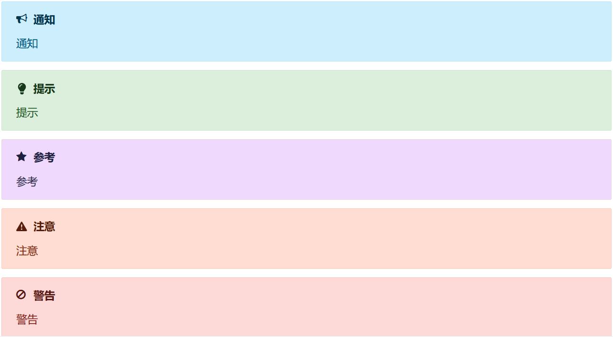
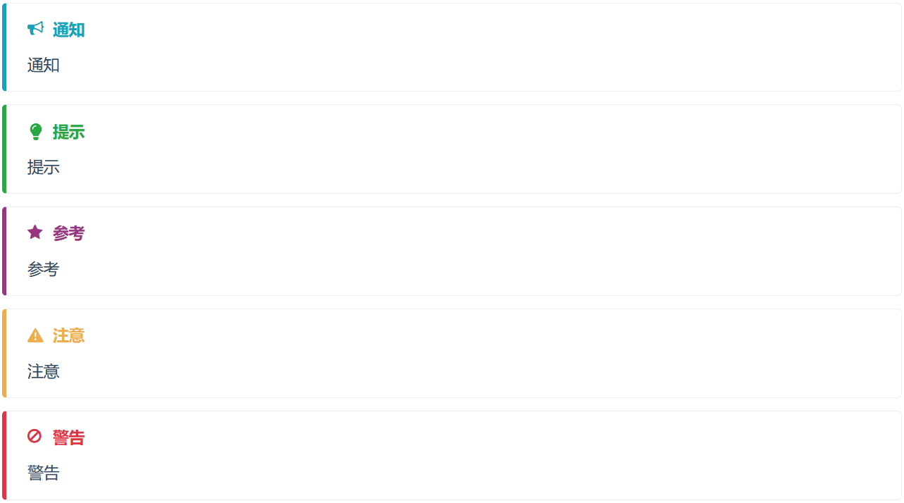

# 投稿相关

### 邮箱地址

`jiaoliao946@163.com`

### 结构说明

结构分级从大到小为：大系列、小系列、章节、文章，前两级统称系列，小系列可以不属于任何大系列，每级均可投稿。

### 文件要求

1. 尽量采用`.md`文件（推荐使用[Typora](https://typoraio.cn/)编辑），要求：

    - 不需要在文章开头使用`[TOC]`，右侧会自动生成目录；
    - 一篇文章只能使用一次一级标题；
    - 可以使用Markdown Admonitions，共有NOTE、TIP、IMPORTANT、WARNING和CAUTION，与Typora中显示的颜色一致；
        - 一般用法
          
          内容：
          
          ```markdown
          > [!NOTE]
          > 通知
          
          > [!TIP]
          > 提示
          
          > [!IMPORTANT]
          > 重要
          
          > [!WARNING]
          > 注意
          
          > [!CAUTION]
          > 警告
          ```
          
          表现：
        - 进阶用法
        
          可以通过在`[]`内使用`|`分隔配置的方式让告示拥有更加自定义化的表现。
            - 更改样式
            
              提供两种样式——flat和callout，默认使用flat，要使用callout需添加配置`style:callout`。
              
              内容：
              
              ```markdown
              > [!NOTE|style:callout]
              > 通知
              
              > [!TIP|style:callout]
              > 提示
              
              > [!IMPORTANT|style:callout]
              > 重要
              
              > [!WARNING|style:callout]
              > 注意
              
              > [!CAUTION|style:callout]
              > 警告
              ```
              
              表现：
            - 更改图标
            
              提供Font Awesome4.7.0（更高的版本暂时有点问题，后续可能会更改）作为图标，[此处](https://fontawesome.com/v4/icons/)可见所有图标，点击想使用的图标后划到下方代码块，复制`class=`后方引号内的内容，在前面加上`icon:`并添加为配置。
              
              内容：
              
              ```markdown
              > [!NOTE|icon:fa fa-wifi]
              > 改图标
              ```
              
              表现：
            - 更改标题
              要更改标题需添加配置`label:New Title`。
              
              内容：
              
              ```markdown
              > [!NOTE|label:告示]
              > 改标题
              ```
              表现：
            - 更改颜色
            
              由于实现方式是修改CSS元素的类名（后续可能会更改），所以颜色只能为有限几个，需添加配置`className:`，其后填入`note`、`tip`、`undefined`、`warning`和`attention`，分别对应蓝、绿、紫、棕和红。
              
              内容：
              
              ```markdown
              > [!NOTE|className:tip]
              > 改颜色
              ```
              
              表现：
            - 关闭图标或标题
            
              要关闭图标需添加配置`iconVisibility:hidden`，要关闭标题需添加配置`labelVisibility:hidden`。
              内容：
              
              ```markdown
              > [!NOTE|iconVisibility:hidden]
              > 关图标
              
              > [!NOTE|labelVisibility:hidden]
              > 关标题
              ```
              
              表现：

2. LaTex（使用KaTex渲染）要求：

    - 如需LaTex公式，用`$$`包含；
    - 除了变量名、类名等标识符和公式、推导过程等式子外，其余英文字符不应采用LaTex公式；

3. 每次投稿均需包含一份`README.md`文件，投稿大系列时，其中每个小系列还需各包含一份`README.md`文件，`README.md`文件要求：

    - 必要：
        - 说明存放地址（哪个系列、哪个章节，或者是单独的系列）；
        - 说明语言（中文、英文等）；
        - 说明侧边栏显示的名称（比真实标题更短），每级都要有；
        - 若是系列，提供写在系列首页的内容；
        - 列出每篇文章分别的作者，若是系列，还需列出其中所有文章的所有作者；
        - 若是系列，列出所有常用工具，若是小系列，还需列出所有参考文档；
    - 非必要：
        - 作者旁标注每个作者分别的头像和点击后希望跳转到的网址（每个作者只需在第一次出现时标注）；

4. 内容要求：

    - 每个段落开头如需缩进，统一用四个半角（即两个全角）空格；
    - 若使用的符号有全角和半角，东亚语言文章采用全角符号，其它语言文章采用半角符号；
    - 指导读者以文本形式输入的内容及各种强调或特指内容用反引号包含；

5. 文件要求：

    - 每个系列或章节均对应一个文件夹，每篇文章对应一个`.md`文件；
    - 所有文件夹和文件均采用英文命名，文件夹采用大写驼峰命名，文件采用小写加`-`分割字母命名；
    - 若使用了图片，请上传一个存有图片的assets文件夹；

6. 其它要求更新中（如果以上内容不合理、有歧义或者可补充也请指出）。。。