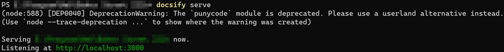
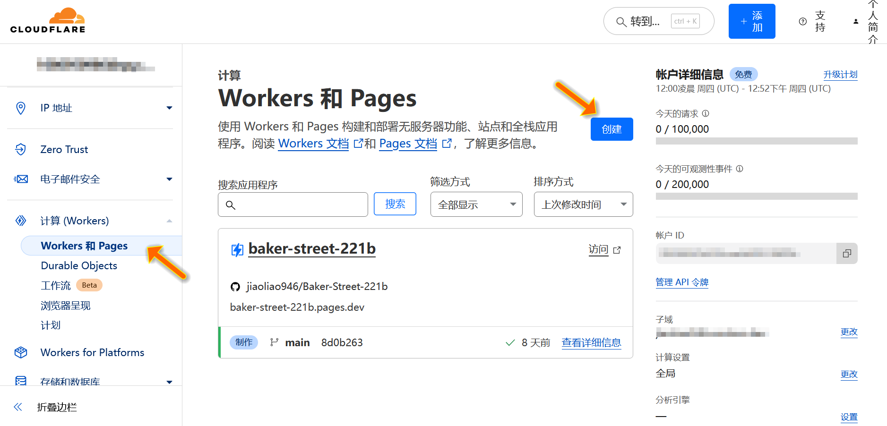

# 基于Docsify和Cloudflare Pages初始化与部署静态博客

## 使用Docsify搭建网站

### 初始化

1. 安装docsify-cli

    ​	Docsify是使用Node.js编写的，所以需要先去[Node.js官网](https://nodejs.org)下载并安装Node.js，安装时除了安装位置自行设置，其余选项一律不用在意。安装完毕后，可以按<kbd>Win</kbd>+<kbd>R</kbd>并输入`cmd`打开命令提示符，再分别查看是否成功安装Node.js和npm，命令如下：

    ```cmd
    node -v
    npm -v
    ```

    ​	npm是Node.js的包管理器，需要使用npm安装docsify-cli包，为了方便在电脑的任意位置执行Docsify命令，建议全局安装docsify-cli包，命令如下：

    ```cmd
    npm i docsify-cli -g
    ```

    ​	其中`i`即`install`，`g`即`global`。

2. 初始化项目

    ​	安装完毕后，记住想要存放项目的文件夹的路径（该文件夹不需要真的存在，执行Docsify初始化命令后会自动创建），再初始化项目，命令如下：

    ```cmd
    docsify init path/to/your/folder
    ```

    ​	初始化项目后，可以在刚才的文件夹下看到三个文件：`index.html`、`README.md`和`.nojekyll`，第一个文件是入口文件，表示项目所有代码的出发点；第二个文件是网站主页要解析的Markdown文件；第三个文件用于在部署到Github Pages时防止其忽视文件名以`_`开头的文件。

### 本地测试

​	因为浏览器会阻止File协议加载远程JS资源，所以不能直接用浏览器打开`index.html`文件，而需要用Docsify命令在本地开服务器运行该项目，命令如下：

```cmd
docsify serve path/to/your/folder
```

​	也可以先在cmd打开刚才的文件夹，然后直接执行命令如下：

```cmd
docsify serve
```

​	这两种方式默认都会在本地开放端口`3000`（如果被占了会开放别的端口，在cmd中会显示），而后用浏览器打开[http://localhost:3000](http://localhost:3000)即可看见初始化后的博客。



## 使用Cloudflare Pages部署网站

​	可以免费部署静态网站的平台有很多，Cloudflare的免费额度比较大方，有域名保护，而且Cloudflare Pages的域名没有被墙。当然，嫌麻烦的话，直接部署到Github Pages上也可以（在Github仓库页面上方菜单点击`Settings`，左侧选择`Pages`，再填写一些内容即可），不过Github Pages比较慢。

​	Cloudflare Pages支持连接Github仓库，所以可以先把代码推送到Github仓库，Github的具体使用参见`通用工具`系列文章中的[Git章节](General/Git/README)。

​	再去[Cloudflare官网](https://www.cloudflare-cn.com/)注册一个账号，并在仪表盘的侧边栏下拉，选择`计算（Workers）`，点击`创建`，选择`Pages`，点击`连接到Git`，按照提示登录Github账号，选择之前新建的仓库，点击`开始设置`，自己填写一个`项目名称`，最后点击`保存并部署`。部署完成后可以看到Cloudflare分配的域名，访问该地址即可看见和之前本地服务器一样初始化后的博客。



> [!IMPORTANT]
> [Docsify官方文档](https://docsify.js.org/#/quickstart)。