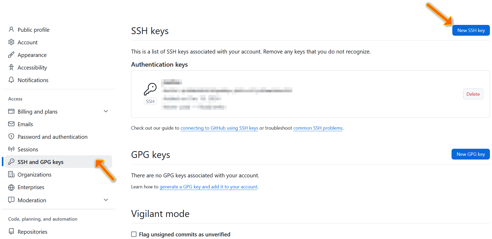

# 使用Github

> Github是一个以Git为唯一版本库格式的代码托管平台。

## 基本操作

​	先去[Github官网](https://github.com/)用邮箱注册一个账号，Github在国内不稳定，可以考虑使用[Watt Toolkit](https://steampp.net/)（即Steam++）加速或者干脆科学上网。

### 配置SSH key

​	为了方便将本地项目上传到Github仓库，需要Github账号给电脑权限，即配置SSH key。先查看电脑是否有SSH key，打开`C:\Users\Administrator`查看是否存在`.ssh`文件夹，如果存在且`.ssh`文件夹中有`id_rsa`和`id_rsa.pub`文件，则说明有shh key，反之没有。

​	如果没有SSH key，打开命令提示符，输入命令如下：

```cmd
ssh-keygen -t rsa
```

​	命令执行完成后，打开`C:\Users\Administrator\.ssh\id_rsa.pub`，全选并复制。登录Github账号，点击右上角头像，选择`Settings`，点击`SSH and GPG keys`，再点击右上角带有`New SSH key`字样的蓝色按钮，自己填写一个`Title`并在`Key`处填入刚才复制的内容，最后点击`Add SSH key`。



### 绑定到IDE

### 实用技巧

1. 统一Git和Github的主分支默认名称

​	因为Git的主分支默认名称为`master`而Github为`main`，所以如果想更加快捷地使用Git GUI一键推送，可以将二者统一，这有多种方法：

- 下载Git时配置：当下载Git进行到`Adjusting the name of the initial branch in new repositories.`时，选择`Override the default branch name for new repositories`并输入`main`；
- 下完Git后配置：
- 配置Github：