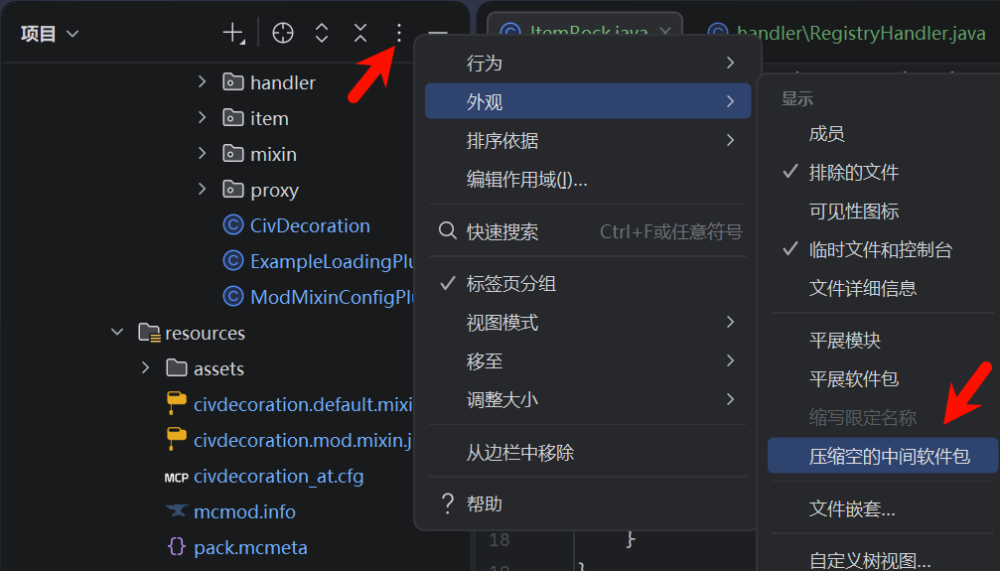

# 添加一个基本的物品

## 一般物品

​	Minecraft中的每个物品种类都是$net.minecraft.item.Item$类的实例。没有特殊功能的简单物品（比如木棍和糖）不需要新建类，可以直接实例化一个$Item$，再调用Setter去设置物品的一些简单属性，常用的Setter及其说明如下：

|      Setter       |                             说明                             |
| :---------------: | :----------------------------------------------------------: |
|  setRegistryName  |                          设置注册名                          |
| setTranslationKey |                         设置翻译密钥                         |
|  setCreativeTab   |                   设置所在的创造模式物品栏                   |
|   setMaxDamage    | 设置最大耐久值，通常用于工具等，如果该值大于0，将会添加2个物品属性——`damaged`和`damage` |
|  setMaxStackSize  |                        设置最大堆叠数                        |
|    setNoRepair    |              设置是否可以被修复，通常用于工具等              |
|  setHarvestLevel  |         设置挖掘等级，通常用于挖掘工具，该方法不可链         |

​	除非特殊说明，以上方法都是可链（Chainable）的，即最后会执行`return this`从而可以连续调用。当然，没有新建类的简单物品也需要下文提到的注册物品、本地化及绑定模型和材质。

​	如果想要实现自定义的逻辑，可以创建$Item$类的子类，接下来以添加一个石子物品为例。

### 新建物品类

​	先在根包下新建一个类$item.ItemRock$并让它继承$Item$类，为该类添加构造方法并在构造方法中使用Setter设置一些简单属性，参考代码如下：

```java
public class ItemRock extends Item {
    public ItemRock() {
        this.setRegistryName("rock");     // Registry Name即资源路径
        this.setTranslationKey(CivDecoration.MOD_ID + ".rock");
        this.setMaxStackSize(64);
    }
}
```

​	这段代码中没有为物品设置创造模式物品栏，所以只能通过`give`指令获得物品。

### 注册物品

​	先实例化这个新的物品类，再监听$Register<Item>$事件，并对接收到的事件调用$getRegistry$方法从而获得物品的注册表，最后对注册表调用$register$方法或$registerAll$方法，前者的参数为一个对象，后者的参数为多个对象或一个数组，参考代码如下：

```java
@Mod.EventBusSubscriber
public class RegistryHandler {
    static final Item[] ITEMS = {
            new ItemRock()
    };

    @SubscribeEvent
    public static void onItemRegistry(RegistryEvent.@NonNull Register<Item> event) {
        event.getRegistry().registerAll(ITEMS);
    }
}
```

​	其它需要注册的游戏元素，比如方块等，也通过差不多的方式注册，只是监听的事件有所更改，比如注册方块时换为$Register<Block>$事件。

### 本地化

​	Minecraft是一款可以选择语言的游戏，国际化（I18n）是一种可以适用于各种语言的代码设计思路，本地化是指显示适用于用户语言的文字的过程。如果读者使用过汉化资源包就应该知道，`.lang`文件是用于本地化的，其中每一行是形如`<>.<>.<>.<> = ...`的键值对。通过以上步骤添加的物品如果没有进行本地化，在游戏中的名称就会是`item.civdecoration.rock.name`，即`.lang`文件中每一行等号左侧的内容，这种形式被称为翻译密钥（Translation Keys），它用于标识一段没有特定语言的可显示文本。

​	获取物品的翻译密钥时后缀`.name`会自动带上，若先前使用$setTranslationKey$方法设置了翻译密钥，则调用$getTranslationKey$方法时前缀`item.`也会自动带上，所以设置翻译密钥时只需要传入中间部分，由于翻译密钥没有命名空间，为了防止冲突，其推荐形式为`模组ID.物品的Registry Name`。

​	其实也可以不在构造方法中调用$setTranslationKey$方法，而是重写参数为一个$ItemStack$对象的$getTranslationKey$方法，这样就可以调用$getRegistryName$方法（返回的是$ResourceLocation$对象）和$getPath()$方法从而根据Registry Name直接得到Translation Key，而不需要单独填写一段字符串，代码如下：

```java
    @Override
    public String getTranslationKey(ItemStack stack) {
        return "item." + CivDecoration.MOD_ID + '.' +
                Objects.requireNonNull(this.getRegistryName()).getPath();
    }
```

​	现在进行本地化，因为资源域对应`resources/assets`目录下的同名文件夹，所以先在`resources`文件夹下新建目录`assets/civdecoration/lang`，该目录下存放各种语言的本地化文件，再在该目录下新建文件`en_us.lang`和`zh_cn.lang`分别用于English(US)和简体中文，全部可用语言见[可用语言](https://zh.minecraft.wiki/w/%E8%AF%AD%E8%A8%80#%E5%8F%AF%E7%94%A8%E8%AF%AD%E8%A8%80)。

​	在`en_us.lang`和`zh_cn.lang`中分别写入`item.civdecoration.rock.name=Rock`和`item.civdecoration.rock.name=石子`即可将游戏中对应的翻译密钥在对应语言下显示为等号右边的内容，注意等号两侧不要有空格。

​	`.lang`文件中以`#`开头的行将被忽略，所以也可以使用注释。若该文件中任何地方包含`#PARSE_ESCAPES`注释，会启用更复杂的Java配置文件格式，这种格式支持多行字符串且导致很多地方发生变化，最重要的是`:`将被视为键值分隔符，键值对中要使用它必须用`\:`进行转义。该文件必须使用UTF-8编码。

### 绑定模型和材质

​	如果没有为物品绑定模型，获得物品时看到的就会是一个紫黑块，这是Minecraft中材质丢失的常见表现形式。绑定模型时需要先监听$ModelRegistryEvent$事件（也可以放在$RegistryHandler$类中），再在接收到事件时调用$ModelLoader$类的$setCustomModelResourceLocation$方法，方法的参数依次为绑定到的$Item$对象、表示绑定到哪个meta（见本文的[Meta Hack](MC/Mod12/Base/item?id=Meta Hack)）的整数和一个被绑定过去的$ModelResourceLocation$对象。

​	$ResourceLocation$对象只是定位资源，而$ModelResourceLocation$对象精确地代表一个模型，它的构造方法的参数为一个$ResourceLocation$对象和一个表示模型变体的字符串，该字符串在绑定物品的模型时永远是`"inventory"`，即“库存”。

​	由于模型渲染只用于客户端，可以把$setCustomModelResourceLocation$方法的调用放到客户端代理类中，先在$CommonProxy$类中定义一个公开的无返回值的参数为一个$Item$对象的无内容的方法$registerModel$，再在$ClientProxy$类中重写这个方法并在其中填入$setCustomModelResourceLocation$​方法的调用，代码如下：

```java
    @Override
    public void registerModel(Item item) {
        ModelLoader.setCustomModelResourceLocation(item, 0,
                new ModelResourceLocation(Objects.requireNonNull(item.getRegistryName()),
                        "inventory"));
    }
```

​	$RegistryHandler$类中$ModelRegistryEvent$​事件的监听器代码如下：

```java
    @SubscribeEvent
    public static void onModelRegistry(ModelRegistryEvent event) {
        for(Item item: ITEMS) CivDecoration.proxy.registerModel(item);
    }
```

​	接下来添加用于描述模型的文件到Resource Location对应的位置，先在`assets/civdecoration`目录下新建目录`models/item`，再在其中新建文件`rock.json`（文件名要和Registry Name一致），在其中写入代码如下：

```json
{
  "parent": "item/generated",
  "textures": {
    "layer0": "civdecoration:items/rock"
  }
}
```

​	这里直接使用了原版的默认物品模型`item/generated`，并指定它唯一一层材质所用的图片文件位于 `assets/civdecoration/textures/items/rock.png`。

​	游戏搜索物品模型的优先级从高到低为：主动加载该模型的自定义模型加载器、方块状态加载器、原版JSON加载器（即`models/item`中的文件）。

​	由此也可以使用方块状态来描述物品模型，Minecraft通过方块状态JSON将表示模型类型的字符串映射到模型，先在`assets/civdecoration`目录下新建目录`blockstates`，再在其中新建文件`rock.json`（文件名要和Registry Name一致），在其中写入代码如下：

```json
{
  "forge_marker": 1,
  "defaults": {
    "textures": { "layer0": "civdecoration:items/rock" },
    "model": "minecraft:builtin/generated"
  },
  "variants": {
    "inventory": [{ "transform": "forge:default-item" }]
  }
}
```

​	`"forge_marker": 1`说明该方块状态JSON来自于Forge，而非原版，其中1是格式的版本。`"defaults"`的内容描述了默认的模型，对于某个变体，它的设置会被`"variants"`的内容中对应的设置覆盖。

​	方块状态JSON只能解析`models/block`下的模型路径，所以不能使用`item/generated`，解决方式是使用`minecraft:builtin/generated`，并在`"inventory"`变体（即显示为物品）时设置`"transform"`的值为`"forge:default-item"`从而转换为原版的默认物品模型。

​	方块状态JSON的更多具体用法见本系列文章`进阶打法`章节的[高级概念](MC/Mod12/Advance/sup)。

> [!TIP]
> 当某个目录下只有一个目录时，IntelliJ IDEA会将这两级目录叠在一起，如果想要展开，先点击`项目`一栏右上角的`选项`，移动到`外观`，再点击`压缩空的中间软件包`从而将其前方的勾去掉，这样就可以展开所有目录。
>
> 

​	最后添加材质文件到由模型描述指定的位置，先在`assets/civdecoration`目录下新建目录`textures/items`，再将材质图片文件`rock.png`移入其中。通常情况下，这个文件的大小是16\*16像素（即原版的大小），当然，更大也可以，但必须长宽一致且为2的若干次方，这个大小就是资源包的所谓“16\*16”和“32\*32”等。

## ItemStack类

​	本文开头提到，$Item$对象只是物品种类，而非真正的物品。其实一堆若干数量的物品（比如背包中每个格子中的物品）是$net.minecraft.item.ItemStack$类的实例，$ItemStack$对象储存了物品的数量和NBT数据等。进一步而言，无论$ItemStack$对象携带的信息如何变化，处理它们的逻辑都不会随之转移，这些逻辑被储存在对应的$Item$对象中，而$ItemStack$对象储存了物品的具体状态。

### “空”

​	按住<kbd>Ctrl</kbd>并点击代码中的$ItemStack$类即可看到该类的具体定义，可以发现其中定义了一个公开的类型为$ItemStack$的静态不可变字段$EMPTY$，它是由`null`得到的，而不是像一般的$ItemStack$对象一样由$Item$对象得到。该$EMPTY$字段表示了物品的“空”这一状态，即什么都没有，准确地说，是表示了$Items.AIR$（空气）这一物品。代表“空”的不止这一个情况，数量非正数的$ItemStack$对象和构造$ItemStack$对象时参数为$Items.AIR$也会被认为是“空”的。

​	由于明确定义了“空”这一状态，任何出现$ItemStack$对象的地方都应该“不可能为`null`”，至于判断给定的$ItemStack$对象是否为“空”，只需要对其调用$isEmpty()$方法就行了。

### 享元

​	这样一种特定物品只对应一个$Item$实例的设计被称为享元（Flyweight Pattern），由此可以直接通过`==`来判断两个物品是否为同一个种类。

## Meta Hack

​	如果读者使用过`give`指令就应该知道，当给予玩家不同的染料时，它们的物品ID是一样的，只是需要填入的一个参数不同，此时这个参数用于表示Metadata；而给予玩家一个不同耐久的同一工具时，物品ID也是一样的，也是需要填入的那个参数不同，此时这个参数用于表示耐久。

​	虽然Metadata和耐久是两个东西，但是它们的具体实现是耦合在一起的，具体而言是共用一个字段来存储的。仿照原版的染料将同一物品ID的不同Metadata设计为不同的物品这一操作即为Meta Hack，该操作可以避免占用过多的物品ID。1.12.2的物品、方块等各种ID是有上限的，而1.13的扁平化更新后ID不再有上限，Metadata被取消了，耐久也被放到了NBT数据中，所以不再需要Meta Hack。

### 新建类和本地化

​	考虑到使用了Meta Hack的物品类有一些通用的字段和方法且构造方法中有一些必要且通用的语句，可以定义一个$ItemSubtypeBase$类并让各种使用了Meta Hack的物品类继承该类，接下来以添加各种岩石对应的石子物品为例。

​	先在$ItemSubtypeBase$类的构造方法中添加语句使物品拥有Metadata，且耐久不会被损耗和修复。接着将$ItemRock$类对$getTranslationKey$方法的重写移动到$ItemSubtypeBase$类中，并考虑在Translation Key的Registry Name后再加上`.对应岩石的名称`，为了简化代码，不妨给$ItemSubtypeBase$类定义一个私有不可变的字符串数组用于储存各种岩石的名称，这样在$getTranslationKey$方法中只需要取出第Metadata个元素即可得到对应的岩石名称。$ItemSubtypeBase$类的代码如下：

```java
public class ItemSubtypeBase extends Item {
    private final String[] subtypeNames;

    public ItemSubtypeBase(String[] names) {
        this.setHasSubtypes(true);
        this.setMaxDamage(0);
        this.setNoRepair();
        this.subtypeNames = names;
    }

    public String[] getSubtypeNames() {
        return this.subtypeNames;
    }

    @Override
    public String getTranslationKey(@NonNull ItemStack stack) {
        short meta = (short)stack.getMetadata();
        return "item." + CivDecoration.MOD_ID + '.' +
                Objects.requireNonNull(this.getRegistryName()).getPath() + '.' +
                this.subtypeNames[meta < this.subtypeNames.length ? meta : 0];     // 防止超出数组范围
    }
}
```

​	因此在$ItemRock$类的构造方法开头需要添加一条`super`语句，其参数为一个字符串数组，数组的元素为各种岩石的名称，至此只需要完善`.lang`文件即可完成本地化。

### 绑定模型和材质

​	先对$registerModel$​方法进行重载，使其可以根据Metadata将物品绑定到不同的模型，代码如下：

```java
    public void registerModel(Item item, int meta, String name) {
        ModelLoader.setCustomModelResourceLocation(item, meta,
                new ModelResourceLocation(item.getRegistryName() + "_" + name,
                        "inventory"));
    }
```

​	再修改$onModelRegistry$方法，在`for`循环中如果遇到了$ItemSubtypeBase$对象，对其每个有效的Metadata分别执行重载后的$registerModel$方法，反之只执行一次$registerModel$方法，代码如下：

```java
    @SubscribeEvent
    public static void onModelRegistry(ModelRegistryEvent event) {
        for(Item item : ITEMS)
            if(item instanceof ItemSubtypeBase) {
                short i = 0;
                for (String name : ((ItemSubtypeBase) item).getSubtypeNames())
                    CivDecoration.proxy.registerModel(item, i++, name);
            } else CivDecoration.proxy.registerModel(item);
    }
```

​	模型的描述应该放在`models/item`目录下形如`rock_stone.json`的文件中，如果使用方块状态JSON则放在`blockstates`文件夹下的同名文件中，材质文件应该放在`textures`目录下由模型描述指定的位置。

> [!IMPORTANT]
> 《我的世界：Minecraft模组开发指南》；
>
> [物品概论](https://harbinger.covertdragon.team/chapter-04/)、[ItemStack](https://harbinger.covertdragon.team/chapter-04/item-stack.html)、[Meta Hack](https://harbinger.covertdragon.team/chapter-04/advanced/meta-hack.html)——[Harbinger](https://harbinger.covertdragon.team/)；
>
> [物品](https://mcforge-cn.readthedocs.io/zh/latest/items/items/)、[国际化和本地化](https://mcforge-cn.readthedocs.io/zh/latest/concepts/internationalization/)、[Forge的方块状态](https://mcforge-cn.readthedocs.io/zh/latest/models/blockstates/forgeBlockstates/)、[绑定模型到方块和物品](https://mcforge-cn.readthedocs.io/zh/latest/models/using/)——[Minecraft Forge官方文档的中文翻译](https://mcforge-cn.readthedocs.io/zh/latest/)；
>
> [创建属于你的物品](https://www.kancloud.cn/gonggongjohn/eok_guide/1610549)——[Minecraft 1.12.2 Forge模组开发指引手册（以EOK为例）](https://www.kancloud.cn/gonggongjohn/eok_guide/1222296)。
