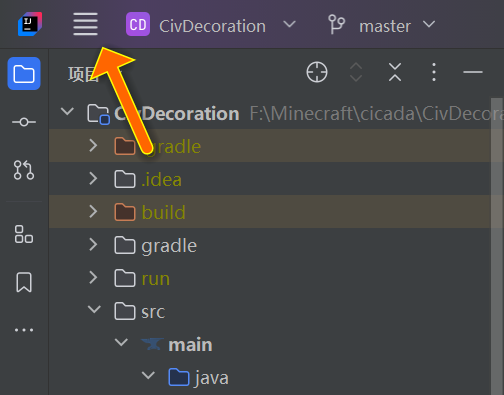
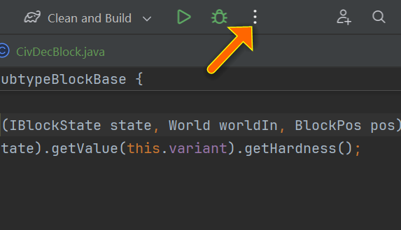
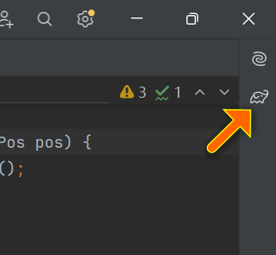

# 搭建开发环境

> 本文大部分内容暂时只保证支持Windows系统。

## 安装JDK

​	Java代码由一系列后缀为`.java`的源代码文件组成，Java代码不能直接在计算机上运行，需要经过编译后产生若干`.class`文件，这些文件和源代码文件不同，它们属于二进制文件，不能直接打开编辑，通常被称为字节码（Bytecode）。用于执行Java字节码的程序被称为Java虚拟机，即JVM（Java Virtual Machine，Java虚拟机）。

​	JRE（Java Runtime Environment，Java运行环境）包含一个JVM，一些Java代码库，还有用于启动JVM并读取Java字节码的包装代码，被用于运行基于Java编写的程序。JDK（Java Development Kit，Java开发工具包）是JRE的超集，除JRE提供的功能外，JDK同时还提供一些用于开发的工具，比如编译Java代码到Java字节码的工具。

​	如果只要运行MC游戏，安装JRE就可以了，但是想要开发模组，就需要安装JDK：

- 如果基于传统的Forge开发，使用Java8，可以下载并安装[Oracle官方的JDK8](https://www.oracle.com/java/technologies/downloads/#java8-windows)，不过由于有优化，推荐使用[阿里巴巴的Dragonwell8](https://dragonwell-jdk.io/)；
- 如果基于Cleanroom开发，使用Java21+，同样可以下载并安装[Oracle官方的JDK21](https://www.oracle.com/java/technologies/downloads/#jdk21-windows)，并且由于优化推荐使用[Azul的Zulu21](https://www.azul.com/downloads/?version=java-21-lts&os=windows&package=jdk#zulu)。安装时除了安装位置自行设置，其余选项一律不用在意。

​	安装完成后，还需要配置环境变量。右击`我的电脑`，选择`属性`，左侧点击`高级系统设置`，右下角点击`环境变量`打开环境变量配置。要配置三个环境变量：

- 点击`用户变量`下的`新建`，在`变量名`处填入`JAVA_HOME`，在`变量值`处填入安装JDK的文件夹路径（要求该路径下一级有`bin`文件夹），最后点击`确定`；
- 选择`用户变量`下的`Path`变量，点击`编辑`，右侧选择`新建`，填入`%JAVA_HOME%\bin`，最后回车并点击确定；
- 新建一个环境变量，`变量名`为`CLASSPATH`，`变量值`为一个字符`.`。

​	都配置完成后，一路`确定`点到底，关闭配置过程中打开的窗口，注意不要右上角直接关闭。此时可以按键盘Win+R并输入`cmd`打开命令提示符，查看是否成功安装JDK，命令如下：

```cmd
javac -version
```

## 下载开发模板

​	在现有模板的基础上开发比较方便，如果基于传统的Forge开发，下载Forge MDK；如果基于Cleanroom开发，下载Cleanroom Mod Template。

### Forge MDK

​	先到[Forge官网](https://files.minecraftforge.net/net/minecraftforge/forge/)（国内不稳定，可能要科学上网或者多等一会儿）找到1.12.2-14.23.5.2860版本的Forge，点击其`MDK`文件，此时会打开一个adfocus的广告页面，点击右上角的`SKIP`按钮即可开始下载。下载后会得到一个压缩包，将其解压到某个文件夹即可。

> [!CAUTION]
> 解压到的路径不应含有非ASCII字符和空格，尽量只使用英文字母、数字和下划线，否则可能会产生未知问题。

### Cleanroom Mod Template

​	先到Github的[CleanroomMC/CleanroomModTemplate](https://github.com/CleanroomMC/CleanroomModTemplate)页面选择想要使用的模板分支，如果要深度开发，迟早要使用Mixin，所以推荐选择名为`mixin`的分支。再下载选择的分支的ZIP，并将其解压到某个文件夹即可。


## 配置IntelliJ IDEA

​	开发MC Forge模组一般使用的IDE（Integrated Development Environment，集成开发环境）有两个——Eclipse和IntelliJ IDEA。其中，前者开源；后者是商业软件，但其Community版本免费，本系列文章均使用后者的Community版本进行讲解。

​	先到[IntelliJ IDEA官网](https://www.jetbrains.com/idea/)下载（注意下载Community版本）并安装IntelliJ IDEA，安装时除了安装位置自行设置，其余选项一律不用在意。

​	然后右键Forge MDK或Cleanroom Mod Template解压后保存到的文件夹，点击`Open Folder as IntelliJ IDEA Project`，用IntelliJ IDEA打开项目，等待右下角的进度条全部加载完毕，则项目构建完成。

​	再在IntelliJ IDEA左上角点击`主菜单`，移动到`文件`选项，点击下方的`设置`，搜索`编码`，选择`文件编码`，把`项目编码`和`属性文件的默认编码`选为`UTF-8`。接着同样点击`主菜单`，选择下方的`项目结构...`，将`SDK`一项设置为上面安装的JDK版本。



​	最后可以把构建模组`.jar`文件的命令定义为任务，从而通过在IntelliJ IDEA上方选择任务并点击运行按钮来快捷执行，而不用每次都到终端执行命令。具体操作为：在IntelliJ IDEA上方点击那三个点，选择`编辑`，左上角点击`+`号，选择`Gradle`，自己填写一个`名称`并在`任务和实参`处填入`clean build`（`clean`用于删除上次构建时生成的所有文件，即清空`build`文件夹；`build`用于构建`.jar`文件），最后点击`应用`，任务就定义好了。运行该任务后，打开项目所在文件夹下的`build\libs`文件夹，其中的`.jar`文件即为生成的模组。



​	如果想要直接通过当前项目打开一个MC客户端或服务端用于测试模组（客户端和服务端相关内容见本章节的[初级概念](MC/Mod12/Pre/pri?id=客户端和服务端)），可以点击右侧的大象图标，打开`FolderName\Tasks`（`FolderName`为当前项目所在文件夹名称），选择`fg_runs`（在Cleanroom Mod Template中为`unimined_runs`），如果该文件夹下没有任务`runClient`或`runServer`，双击运行`genIntelliJRuns`，命令执行完毕后就会生成这两个任务，它们分别为打开物理客户端和打开物理服务端。



> [!IMPORTANT]
> 《我的世界：Minecraft模组开发指南》；
>
> [新人如何使用cleanroom进行更现代化的模组开发](https://www.mcmod.cn/post/5838.html)——[MC百科](https://www.mcmod.cn/)。