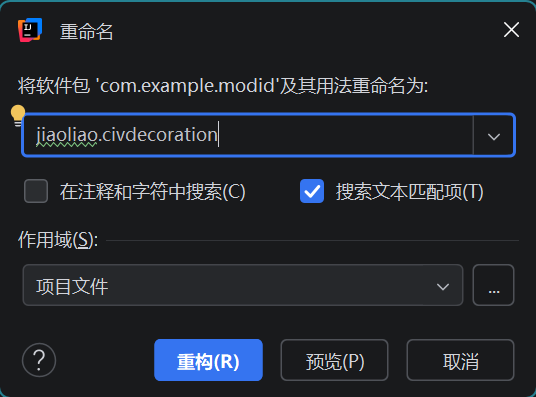

# 构建并运行第一个模组

> 从本文开始，本系列文章基于Cleanroom讲解所有内容，与传统Forge可能有区别。

​	在IntelliJ IDEA中打开项目并在`项目`一栏找到`src`文件夹，模组的源代码和资源文件等描述模组行为逻辑和外观的文件都应该放在这个文件夹中。其中，`src/main/java`目录存放模组的Java源代码，`src/main/resources`目录存放模组的资源文件。

## 修改程序

### 包名

​	模组的包名通常以`作者名称.模组ID`开头，比如`blusunrize.immersiveengineering`代表这个模组名为Immersive Engineering（沉浸工程），作者为BluSunrize。现在修改包名，先右键点击`com.example.modid`，再移动到`重构`并点击`重命名`，接着填写新的包名（此处为`jiaoliao.civdecoration`）后点击下方的`重构`（在本系列文章中，以后将重构后的包简称为“根包”）。等待一段时间后就可以完成重构（Refactor），但是还会留下一个`com.example`包，右键点击并选择`删除`即可将其删去。



### 主类

​	打开根包下的$ExampleMod$类，可以发现IntelliJ IDEA自动将文件中的包名替换了，此外IntelliJ IDEA还会自动补充并在重构时修改使用`import`语句导入的类和包，这就是IDE（Integrated Development Environment，集成开发环境）的方便之处。

​	再在该文件中找到$@MOD$注解，它会告诉FML这个注解修饰的类是一个模组的入口，即主类（Main Class），一个模组有且只有一个主类，一个JAR可以有很多个模组。接着把主类的类名改为想要的名称（一般和模组ID对应，此处为`CivDecoration`），右键点击代码中的类名`ExampleMod`，移动到`重构`并点击`重命名`，而后直接填写新的类名并回车即可自动完成各种文件中的替换。

> [!TIP]
> 在完成各种操作后编辑页面右上方可能会出现一个带有叉号的Gradle图标，这是在提醒更新Gradle配置，点击该图标后等待右下角的进度条加载完毕即可。

​	不过还有几个文件需要修改，那就是`resources`文件夹根目录的`modid_at.cfg`、`modid.default.mixin.json`和`modid.mod.mixin.json`，重命名时将名称中的`modid`换为真正的模组ID。再打开这两个`.json`文件，将其中的`com.example.modid`一律换为先前设置的`作者名称.模组ID`。注意这两个`.json`文件中`"client"`的值分别为`["MinecraftMixin"]`和`["hei.JustEnoughItemsMixin"]`，如果变化了要改回来，没有报错（右上角为绿勾）即可。

​	在IDE中按住<kbd>Ctrl</kbd>并点击代码元素即可看到该代码元素的定义、继承等相关的代码，比如可以对着$@MOD$试试，$@MOD$的各种属性及其说明如下：

|             属性              |  类型   |                             说明                             |
| :---------------------------: | :-----: | :----------------------------------------------------------: |
|             modid             | String  |        必填，模组ID，不允许含有大写字母，最大长度为64        |
|             name              | String  |               模组名称，为空则直接使用$modid$                |
|            version            | String  |                           模组版本                           |
|         dependencies          | String  | 模组前置。可以用4个前缀：`before`、`after`、`required-before`、`required-after`，而后加上`:modid`。可以用`@`指定前置的版本范围，格式见[Maven Version Range Specification](https://maven.apache.org/enforcer/enforcer-rules/versionRanges.html)。如果一个前置模组缺失或者版本不在范围之内，游戏将无法启动，并且会显示一个错误界面给出需要什么模组的什么版本 |
|          useMetadata          | boolean |           若为真, $@MOD$的属性会被`mcmod.info`覆盖           |
| clientSideOnly/serverSideOnly | boolean | 若其中一个为真，会在另一端被跳过，不会被加载，如果均为真，游戏会崩溃 |
|   acceptedMinecraftVersions   | String  | 适用的Minecraft版本，`""`匹配所有版本，格式同`dependencies`的版本范围 |
|   acceptableRemoteVersions    | String  | 适用的服务器版本范围，`""`匹配当前版本，`"*"`匹配所有版本（即使服务器上不存在该模组，也会匹配） |
|    acceptableSaveVersions     | String  |                 适用的保存版本信息的版本范围                 |
|    certificateFingerprint     | String  |                         用于JAR签名                          |
|          modLanguage          | String  |            模组的编程语言，可以是`java`或`scala`             |
|      modLanguageAdapter       | String  | 模组的语言适配器路径。该类必须具有默认构造函数，并且必须实现$ILanguageAdapter$，否则Forge会崩溃。如果设置了该属性，将会覆盖`modLanguage` |
|       canBeDeactivated        | boolean | 如果模组可以被停用，可以将其设为真，那么该模组会收到`FMLDeactivationEvent`从而执行清理任务 |
|          guiFactory           | String  |             模组的GUI Factory的路径（如果存在）              |
|          updateJSON           | String  | 用于检查更新的`.json`文件的链接，格式见[Forge更新检查器](https://mcforge-cn.readthedocs.io/zh/latest/gettingstarted/autoupdate/#forge) |

> [!TIP]
> 版本格式常用[语义化版本](https://semver.org/lang/zh-CN/)（Semantic Versioning，简称SemVer），基本格式为`主版本号.次版本号.修订号`，具体要求见链接。
>
> 其实可以在`resources`文件夹下新建一个`.json`文件用于检查更新，再找到`build.gradle`文件中`def filterList = `处并在后面的数组中添加该`.json`文件的名称的字符串，这样就可以像在`mcmod.info`中一样在构建时把`${...}`自动替换为`gradle.properties`中对应配置的值。若代码开源，则用于检查更新的JSON链接只要填开源平台上指向该文件的链接即可。

​	可以发现文件中$@MOD$的3个属性的值均来自$Reference$类，这个类在`java-templates`下，不过由于阅读旧版模组教程留下的习惯，笔者把整个`java-templates`删掉了，直接在主类中定义3个公开的静态不可变字段用于提供属性值，再将文件中其它用到了$Reference$类的地方换为对应的字段。当然，也可以把$Reference$类移动到`java`文件夹下的某个目录处，删掉`java-templates`，并通过该类提供属性值。

### 日志

​	使用$LogManager.getLogger$方法得到的字段$LOGGER$储存了模组的日志系统，调用它的$info$方法将输出一条日志，而$getLogger$方法中填入的字符串参数将被放在这条日志的开头，形如`[...]: `，而后才是具体的日志内容。

​	当生命周期事件触发时，FML会去通知模组并调用主类下被$@EventHandler$注解修饰的方法，该方法只能有一个参数并且由该参数的类型决定什么事件触发时调用该方法，因此每个生命周期事件在FML中都唯一对应一个类型。在这三个生命周期事件中，Pre-Initialization事件最常使用。

​	对于老版本的Minecraft，尤其是1.10之前，生命周期事件往往还用于注册方块、物品等，但是对于 1.12.2的Minecraft，方块、物品等很多游戏元素都有专用的注册方式，不再需要生命周期事件。当然，仍然有一些游戏元素的注册需要放到生命周期事件中完成。

### 实例

​	为了模组间的联动，需要定义模组的实例用于模组间互相访问，在主类中使用$@Instance$注解修饰并定义一个类型为主类的公有静态字段表示模组的实例。

### 代理

​	Minecraft在服务端和客户端上有两套相似却又不同的代码，因此模组也需要在服务端和客户端上运行不同的代码，这就需要依赖代理（Proxy）来对这两套代码进行分类。客户端和服务端相关内容见本章节的[初级概念](MC/Mod12/Pre/pri?id=客户端和服务端)。

​	先定义两个不同的类分别用于物理服务端和物理客户端，右键根包，移动到`新建`并点击`软件包`，填写一个包名（一般为`proxy`）并回车从而新建一个包用于存放这两个类。再在新建的包下新建这两个类，移动到`新建`后点击`Java类`、填入类名并回车即可。因为物理服务端的大部分代码在物理客户端也会运行，所以前者和后者的类名一般分别为`CommonProxy`和`ClientProxy`，且后者继承前者。

​	接着就可以在$CommonProxy$类和$ClientProxy$类中让同一方法有不同操作，比如可以定义三个没有内容的方法，分别在主类的三个监听器接收到对应的生命周期事件时调用，再让$ClientProxy$的这三个方法分别重写前者的对应方法并使用`super`关键字执行和对应方法同样的操作。

​	最后在主类中使用$@SidedProxy$注解修饰并定义一个类型为$CommonProxy$类的公有静态字段用于在程序的其它地方调用代理类的方法，再将$@SidedProxy$注解的$clientSide$属性和$serverSide$属性的值分别设为指向$CommonProxy$类和$ClientProxy$类的字符串。

​	当然，定义一个接口$IProxy$作为该公有静态字段的类型并让两个代理类分别实现这个接口也可以。

​	以上三个类的参考代码分别如下：

```java
@Mod(modid = CivDecoration.MOD_ID, name = CivDecoration.NAME, version = CivDecoration.VERSION,
        acceptedMinecraftVersions = "1.12.2")
public class CivDecoration {
    public static final String MOD_ID = "civdecoration";
    public static final String NAME = "Civolution:Decoration";
    public static final String VERSION = "1.0.0";
    private static final String SERVER_SIDE = "jiaoliao.civdecoration.proxy.CommonProxy";
    private static final String CLIENT_SIDE = "jiaoliao.civdecoration.proxy.ClientProxy";

    @Mod.Instance
    public static CivDecoration instance;

    @SidedProxy(serverSide = SERVER_SIDE, clientSide = CLIENT_SIDE)
    public static CommonProxy proxy;

    public static final Logger LOGGER = LogManager.getLogger(NAME);

    @Mod.EventHandler
    public void preInit(FMLPreInitializationEvent event) {
        LOGGER.info("Hello From {}!", NAME);
    }

    @Mod.EventHandler
    public void init(FMLInitializationEvent event) {}

    @Mod.EventHandler
    public void postInit(FMLPostInitializationEvent event) {}
}
```

> [!TIP]
> 读者可能发现代码中使用的是$@Mod.Instance$和$@Mod.EventHandler$，而文本描述的是$@Instance$和$@EventHandler$，点开`import`比较一下就可以知道，它们是同一个东西。

```java
public class CommonProxy {
    public void preInit(FMLPreInitializationEvent event) {}

    public void init(FMLInitializationEvent event) {}

    public void postInit(FMLPostInitializationEvent event) {}
}
```

```java
public class ClientProxy extends CommonProxy {
    @Override
    public void preInit(FMLPreInitializationEvent event) {
        super.preInit(event);
    }

    @Override
    public void init(FMLInitializationEvent event) {
        super.init(event);
    }

    @Override
    public void postInit(FMLPostInitializationEvent event) {
        super.postInit(event);
    }
}
```

## 完善信息

### mcmod.info

​	`resources`文件夹根目录的`mcmod.info`文件是用于描述模组的文件（即模组的元数据），其中存放着模组的相关信息，在生成模组后位于JAR的根目录，会被显示于Minecraft中对应模组的介绍页面（以下简称“介绍页面”）。它的格式是JSON（JavaScript Object Notation，JavaScript对象表示法），其中各种属性及其说明如下：

|           属性           |   类型   |                             说明                             |
| :----------------------: | :------: | :----------------------------------------------------------: |
|          modid           |  string  |                         必填，模组ID                         |
|           name           |  string  |                        必填，模组名称                        |
|       description        |  string  |                  模组简介，可以使用`\n`换行                  |
|         version          |  string  |                           模组版本                           |
|        mcversion         |  string  |                     适用的Minecraft版本                      |
|           url            |  string  |                         模组主页链接                         |
|        updateUrl         |  string  |           有定义但没有实际用处，被`updateJSON`取代           |
|        updateJSON        |  string  |               用于检查更新的`.json`文件的链接                |
|        authorList        | [string] |                         模组作者列表                         |
|         credits          |  string  |                             鸣谢                             |
|         logoFile         |  string  |     logo的地址，根目录是`resources`文件夹，最好背景透明      |
|       screenshots        | [string] |          介绍页面显示的图片的地址，相关功能还未实现          |
|          parent          |  string  |                         前置模组的ID                         |
| useDependencyInformation | boolean  | 如果设置为true并且`Mod.useMetadata`也设置为true，则模组将会使用下面3个依赖列表，反之下面3个值不会生效 |
|       requiredMods       | [string] | 一个模组ID列表，如果缺少其中的模组，游戏将弹出提示并停止加载，不会影响模组加载顺序 |
|       dependencies       | [string] | 一个模组ID列表，列出的模组将在该模组加载前加载，留空则无事发生 |
|        dependants        | [string] | 一个模组ID列表，列出的模组将在该模组加载后加载，留空则无事发生 |

> [!TIP]
> JSON的语法非常简单，并且在以后的模组开发中会被大量使用，请自行上网搜索学习或者查阅[菜鸟教程](https://www.runoob.com/json/json-tutorial.html)。

​	其中，`modid`、`name`和`description`等的值可以不修改，因为会在构建时被自动替换为`gradle.properties`中对应配置的值。

​	但是读者可能会发现`gradle.properties`中值含有中文的配置项到`mcmod.info`对应处变成了乱码，这是因为使用了$findProperty$方法读取配置项的值、转化为字符串并用于`mcmod.info`，$findProperty$方法采用ISO-8859-1编码将数据值转化为字符串，但`gradle.properties`采用UTF-8编码。所以需要知道使用$findProperty$方法得到的字符串的数据值，再得到数据值在UTF-8编码下对应的字符串，这才是没有乱码的字符串。

​	在`项目`一栏打开`gradle/scripts/helpers.gradle`文件，找到如下代码：

```groovy
return interpolate(value)
```

​	并将其换为如下代码：

```groovy
return interpolate(new String(value.getBytes("ISO-8859-1"), "UTF-8"))
```

​	其中，先使用$getBytes$方法得到字符串在ISO-8859-1编码下对应的数据值，再依据该数据值和UTF-8编码 new一个String对象。

### gradle.properties

​	在`项目`一栏打开`gradle.properties`文件，其中可以填入与模组构建相关的配置，常用配置及其说明如下：

|           配置            |                    说明                     |
| :-----------------------: | :-----------------------------------------: |
|        mod_version        |                  模组版本                   |
|       root_package        |     根包，即上面设置的`作者名称.模组ID`     |
|          mod_id           |                   模组ID                    |
|         mod_name          |                  模组名称                   |
|      mod_description      |                  模组简介                   |
|          mod_url          |                模组主页链接                 |
|      mod_update_json      |       用于检查更新的`.json`文件的链接       |
|        mod_authors        |                模组作者列表                 |
|        mod_credits        |                    鸣谢                     |
|       mod_logo_path       |                 logo的地址                  |
|        is_coremod         |         构建到的JAR是否包含Coremod          |
|   coremod_includes_mod    | 该Coremod是否包含主类，即是否使用$@MOD$注解 |
| coremod_plugin_class_name |           Coremod入口类的完整类名           |

​	生成的`.jar`文件名称是`mod_id-mod_version`，如果想要该名称有额外内容，直接修改`mod_id`显然不是个好主意。可以打开`build.gradle`文件，搜索`archivesName.set`并将其后的`'mod_id'`改为`'mod_name'`，这样生成的`.jar`文件名称就是`mod_name-mod_version`，而后修改`mod_name`即可。

## 构建运行

​	完成上述操作后就可以构建模组了，如果添加了构建任务，直接在IntelliJ IDEA上方选择构建任务并点击`运行`即可，注意：构建需要联网。可以在左下角打开`运行`界面，看到`执行完成`则构建完成。此时在`项目`一栏打开`build/libs`目录即可看到两个`.jar`文件，其中没有`-sources`后缀的就是可以正常添加到Minecraft中的模组文件，另一个则是将源码直接打包得到的。使用解压软件软件分别打开这两个文件，可以发现前者的`.class`文件在后者同位置处都变为了同名的`.jar`文件，如果开源该模组，可以在发布模组的地方把第2个文件也一起发布。

​	可以点击打开右侧的Gradle图标并双击`runClient`任务，而后会打开一个Minecraft物理客户端，再在`项目`一栏打开`run/client`目录——相当于这个物理客户端的`.minecraft`文件夹，由此打开日志即可找到`[...]: Hello From ...!`的字样。执行`runClient`任务或`runServer`任务时会根据当前代码构建模组并启动相应的物理端，但不会在`build/libs`目录更新`.jar`文件。

​	当然，将模组添加到装有Cleanroom的Minecraft中并启动也可以。

> [!IMPORTANT]
> 《我的世界：Minecraft模组开发指南》；
>
> [Mod的结构](https://mcforge-cn.readthedocs.io/zh/latest/gettingstarted/structuring/)——[Minecraft Forge官方文档的中文翻译](https://mcforge-cn.readthedocs.io/zh/latest/)；
>
> [你的第一段模组代码](https://www.kancloud.cn/gonggongjohn/eok_guide/1610548)——[Minecraft 1.12.2 Forge模组开发指引手册（以EOK为例）](https://www.kancloud.cn/gonggongjohn/eok_guide/1222296)；
>
> [新人如何使用cleanroom进行更现代化的模组开发](https://www.mcmod.cn/post/5838.html)——[MC百科](https://www.mcmod.cn/)。

