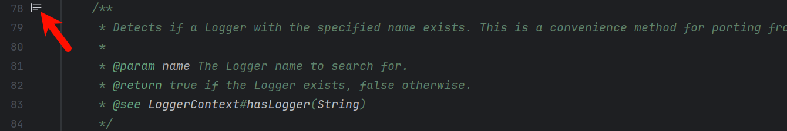
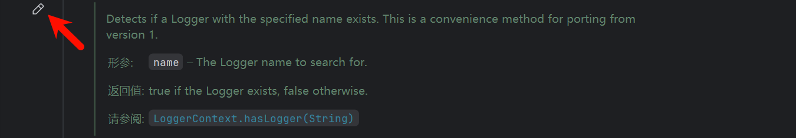

# 学习Java基本知识

> 笔者在学习开发Minecraft模组之前只学习过C++，Java是一边查资料开发模组一边学习的。其实编程语言大同小异，但是Java还是有一些不同于其它语言的特殊之处和使用技巧，所以将开发过程中学习到的Java相关知识整理为本文。读者如果熟练掌握Java，可以跳过本文，反之也可以在大致浏览本文前几节后先阅读后续文章，再在有疑问时查阅本文。

## 底层概念

### 包

​	Java源代码是以包（Package）的形式来组织的，包通常的表现形式为由`.`分隔的一系列字符串，包可以是其它包的子包（SubPackage），比如`com.example.modid`是`com.example`的子包，而`com.example`是`com`的子包。

​	和文件夹一样，包采用了树形的存储方式。同一个包中类的名字不同，不同的包中类的名字可以相同，包相当于创建了命名空间，当同时调用两个不同包中相同类名的类时，应该加上包名加以区别。这个树形结构在源代码中是以文件目录树的形式展现的，比如`com.example.modid`代表`com/example/modid`目录。

​	在Java中，大量代码都是以包的形式组织的，比如：

- Java官方提供的很多代码都位于`java`包下，作为`java`包的子包，比如`java.io`包含和输入/输出有关的函数，`java.lang`包含一系列基础的类和接口；
- 所有和Minecraft有关的代码都位于`net.minecraft`包下，而所有和Minecraft Forge有关的代码都位于`net.minecraftforge`包下，其中有一个`net.minecraftforge.fml`子包，存放所有FML的代码。

​	通常情况下，位于若干个包中的代码会打包压缩，得到常见的JAR（Java Archive，Java归档文件），并被开发者作为第三方库引用。在同一个JAR里的包一般都是同一个包的子包。编译的时候，编译器为包中定义的每个类、接口等类型各创建一个不同的输出文件，输出文件的名字就是这个类型的名字，并以`.class`为拓展名。

​	`.class`文件存放了对应类型的字节码，运行时JVM实际执行的是字节码而非Java源代码，其实Scala、Kotlin这样的语言也会被编译成Java字节码并通过JVM执行，所以它们被称为JVM语言。字节码相对于汇编语言而言，可读性极高且与源代码非常吻合，所以把一个`.class`文件反编译成Java代码不会太难。

1. 包的命名

    ​	包名通常以倒置的域名开头，比如：

    - Minecraft官方网站的域名为`minecraft.net`，其包名均以`net.minecraft`开头；
    - Minecraft Forge官方网站的域名为`minecraftforge.net`，其包名均以`net.minecraftforge`开头；
    - Google提供的一些第三方库的包名均以`com.google`开头；

    ​	如果不存在域名或者不方便使用域名，那么包通常会以项目名称开头。包名通常有以下规定：

    - 不应使用小写字母和数字之外的字符，由`.`分隔的每一级第一个字符不应是数字；
    - 如果某级有多个单词，那么应该简单地拼接在一起，不应使用下划线等字符分隔。

2. 包相关的关键字

    ​	在Java代码开头需要用`package`关键字声明当前类所属包，直接在`package`后接`包名;`即可。

    ​	为了能够使用某一个包的成员，需要在Java代码中明确导入该包。在Java中，`import`关键字用于导入其他类或包中定义的类、接口或静态成员，以便在当前源文件中直接使用这些类型，而不需要完整地指定类的包名。

    ​	在Java代码中，`import`语句位于开头的`package`语句之后，类定义之前，直接在`import`后接`包名.类名;`即可。如果在一个包中，一个类想要使用本包中的另一个类，那么该包名可以省略。也可以使用通配符`*`作为类名来引入整个包中的所有类，但不会引入该包的子包。同一个包下的类在互相调用时不用提前引入。

### 类型

​	Java是一门静态类型（Statically Typed）编程语言，代码中的所有变量都需要显式声明其类型，一个变量是一个类型的实例（Instance）。Java中出现的所有类型分为值类型（Value Type）和引用类型（Reference Type），值类型又称基本数据类型（Primitive Type），它们的实例通常可以和计算机的内存一一对应。

1. 基本数据类型

    ​	基本数据类型共有8个，分别占用的内存大小和默认值如下：

    | 数据类型 | 内存大小/字节 |  默认值  |
    | :------: | :-----------: | :------: |
    | boolean  |    不确定     |  false   |
    |   char   |       2       | '\u0000' |
    |   byte   |       1       |    0     |
    |  short   |       2       |    0     |
    |   int    |       4       |    0     |
    |   long   |       8       |    0L    |
    |  float   |       4       |   0.0F   |
    |  double  |       8       |   0.0    |

    ​	单独的boolean占用的内存大小和boolean数组中每个元素占用的平均大小不同，并且此二者还取决于JVM的具体实现方式；char能够表示绝大多数Unicode字符。
    
    ​	整型、实型和字符型数据可以混合运算，运算中不同类型的数据先转化为同一类型，再进行运算，转换的优先级由低到高为：byte/short/char -> int -> long -> float -> double。数据类型转换必须满足以下规则：

    - 不能对boolean类型进行类型转换；
    - 不能把对象类型转换成不相关类的对象；
    - 在把容量大的类型转换为容量小的类型时必须使用强制类型转换；
    - 转换过程中可能导致溢出或损失精度；
    - 浮点数到整数的转换是通过舍弃小数得到，而不是四舍五入。
    
2. 引用类型

    ​	引用类型通常是基本数据类型的组装，其默认值为`null`，这种类型的实例通常被称为对象（Object），因而通常称Java是一门面向对象（Object Oriented，简称OO）的语言。

    ​	数组（Array）是一种引用类型，它相当于若干同一类型的对象的有序排列，一个数组对象最多能储存的元素个数为其长度，因而一个数组对象即一个长度无法变化的列表。

    ​	有一种常见的引用类型被称为类（Class），所有对象都是以类的形式组织和管理的。“类”就是分类，比如每个单独的人都是“人类”这一类的实例。

    > [!TIP]
    > Java规定所有`java.lang`包下的类都被默认引用，所以无需额外引用即可直接使用。

    ​	还有一种引用类型被称为接口（Interface），一个对象可以同时是多个类的实例，也可以同时是多个接口的实例。接口表示遵守一些约定或者拥有一些能力，比如将“能够进行光合作用”作为一个接口，则几乎所有植物都是这个接口的实例。

    ​	通常情况下，Java源代码中有多个储存在不同目录的不同`.java`文件中的类和接口，这些目录就是包，因而包是Java代码的最大一级组成单元，类和接口是其下一级。所以不是像C++一样在独立的函数里有操作，更不会像Python一样可以直接把操作放在外面。

    > [!TIP]
    > 那么Java代码从哪里开始执行呢？答案是`main`方法，`main`方法由JVM执行，一般使用`public`和`static`修饰，无返回值，即`void`，一个Java程序有且只能有一个`main`方法。

3. 包装器类型

    ​	为了让基本数据类型的实例成为对象从而可以使用各种方法并兼容需要对象的场景~~（比如情人节）~~，Java添加了一些特殊的类——包装器类型（Wrapper Types），其中$Boolean$、$Character$、$Byte$、$Short$、$Integer$、$Long$、$Float$和$Double$分别对应boolean、char、byte、short、int、long、float和double。这样就可以使用$Integer$类的$parseInt$方法将字符串转换为整数，或使用$Character$类的$isDigit$方法检查字符是否为数字等。

## 基础语法

​	最基础的语法知识当然是每条语句（Statement）以`;`结尾且按出现的先后次序执行。

### 注释

​	注释（Comment）的内容与程序的执行无关，只是为了方便开发者理解代码，起到解释说明的作用。Java中的行注释以`//`开头；块注释，又称多行注释，以`/*`开始、以`*/`结束。

​	Java还有一种被称为文档注释的注释，它以`/**`开始、以`*/`结束，其间每行都以`*`开头，它通常出现在类、方法、字段等的定义前面，用于生成Java Doc（自行上网搜索学习）。代码文档在IDE编辑窗口可以被渲染为悬浮显示的样子，因而类、字段、方法和构造方法等的定义前都推荐使用文档注释。





​	文档注释的格式通常包含一些特定的标签，如`@param`用于描述方法参数，`@return`用于描述返回值，`@throws`用于描述可能抛出的异常等等，这些标签有助于生成清晰的API文档，以便开发者能够更好地理解和使用代码。

### 字面量

​	不需要通过运算得到并且可以直接在代码中给出的值被称为字面量（Literal），字面量有以下规则：

- boolean的实例只有两个可能取值——true（真）和false（假）；
- 用一对单引号包围一个字符，用一对双引号包围一个字符串；
- 默认的整型是int，需要在数字后加`L`或`l`以声明其为long类型，否则数字大小超过int的范围就会报错；
- 默认的实型是double，需要在数字后加`F`或`f`以声明其为float类型，否则无法给float的实例赋值。

### 运算符

​	运算符用于操纵变量，Java的运算符可以分为算数运算符、关系运算符、位运算符、逻辑运算符、赋值运算符和其它运算符，可以使用一对括号包围从而提升表达式的优先级。

​	算数运算符及其说明如下：

| 运算符 |                             说明                             |
| :----: | :----------------------------------------------------------: |
|   +    |        左加右，可用于拼接字符串或字符串与任意实例相加        |
|   -    |                            左减右                            |
|   *    |                            左乘右                            |
|   /    |                左除以右，两个整数相除向下取整                |
|   %    |                        左除以右的余数                        |
|   ++   | 自增，变量可以在左或在右，在左则先进行自增再进行表达式运算，在右反之 |
|   --   |                          自减，同上                          |

> [!WARNING]
> 当浮点数除以0时，结果为Infinity（无穷大）或NaN（Not a Number，不是一个数字）；当整数除以0时会抛出异常。

​	关系运算符及其说明如下：

| 运算符 |             说明             |
| :----: | :--------------------------: |
|   ==   |    左等于右为真，反之为假    |
|   !=   |   左不等于右为真，反之为假   |
|   >    |    左大于右为真，反之为假    |
|   <    |    左小于右为真，反之为假    |
|   >=   | 左大于或等于右为真，反之为假 |
|   <=   | 左小于或等于右为真，反之为假 |

​	位运算符及其说明如下：

| 运算符 |                             说明                             |
| :----: | :----------------------------------------------------------: |
|   &    |                          左右按位与                          |
|   \|   |                          左右按位或                          |
|   ^    |                         左右按位异或                         |
|   ~    |                        对右侧按位取反                        |
|   <<   |                左操作数左移右操作数指定的位数                |
|   >>   | 左操作数右移右操作数指定的位数，若为正数，高位插入0；若为负数，高位插入1 |
|  >>>   |     左操作数右移右操作数指定的位数，高位无论正负均插入0      |

​	逻辑运算符及其说明如下：

| 运算符 |                 说明                 |
| :----: | :----------------------------------: |
|   &&   |  逻辑与，左右均为真才为真，反之为假  |
|  \|\|  | 逻辑或，左右一个为真就为真，反之为假 |
|   !    |           对右侧逻辑值取反           |

> [!Tip]
> 也可以用`&`和`|`进行逻辑运算，不过性能不如`&&`和`||`，因为`&&`在左侧为假时就会得到假，`||`在左侧为真时就会得到真，不会考虑右侧。

​	赋值运算符及其说明如下：

| 运算符 |               说明               |
| :----: | :------------------------------: |
|   =    |           将右赋值给左           |
|   +=   |         将左加右赋值给左         |
|   -=   |         将左减右赋值给左         |
|   *=   |         将左乘右赋值给左         |
|   /=   |        将左除以右赋值给左        |
|   %=   |     将左除以右的余数赋值给左     |
|  <<=   | 将左操作数左移右操作数指定的位数 |
|  >>=   | 将左操作数右移右操作数指定的位数 |
|   &=   |       将左右按位与赋值给左       |
|  \|=   |       将左右按位或赋值给左       |
|   ^=   |      将左右按位异或赋值给左      |

​	条件运算符又称三元运算符，其格式为`条件 ? 满足条件返回的值 : 不满足条件返回的值`；运算符`instanceof`用于判断左侧对象是否是右侧类或接口的实例，是则为真，反之为假；运算符`.`用于获取字段或者调用方法。

​	运算符的优先级顺序从高至低为：

|   类别   |                    运算符                    |
| :------: | :------------------------------------------: |
|   后缀   |                    (), .                     |
|   一元   |                   x++, x--                   |
|   一元   |                ++x, --x, ~, !                |
|   乘性   |                   *, /, %                    |
|   加性   |                     +, -                     |
|   移位   |                 <<, >>, >>>                  |
|   关系   |                 >, >=, <, <=                 |
|   相等   |                    ==, !=                    |
|  按位与  |                      &                       |
| 按位异或 |                      ^                       |
|  按位或  |                      \|                      |
|  逻辑与  |                      &&                      |
|  逻辑或  |                     \|\|                     |
|   条件   |                     ? :                      |
|   赋值   | =, +=, -=, *=, /=, %=, <<=, >>=, &=, \|=, ^= |

> [!TIP]
> 在Java中，除了字符串内部，所有空白字符（空格、换行和制表符等）都是等价的。

### 条件语句

​	条件语句（Conditional Statement）允许程序根据条件的不同执行不同的代码块，即调整程序的控制流（Control Flow）。

1. `if-else`语句

    ​	`if`语句用于在满足某个条件时执行某些语句，其基本格式如下：

    ```java
    if(逻辑表达式) {
    	...
    }
    ```

    ​	若`逻辑表达式`的值为真则执行大括号里的语句，反之不执行。当大括号里的语句只有一行时，可以不需要大括号。还可以在为假时执行其它语句，需要用到`else`关键字，基本格式如下：

    ```java
    if(逻辑表达式) {
    	...
    } else {
    	...
    }
    ```

    ​	如果执行的语句比较简单，可以用条件运算符代替`if-else`语句。`else`关键字后也可以继续接`if`语句，类似这样：

    ```java
    if(逻辑表达式1) {
    	...
    } else if(逻辑表达式2){
    	...
    } else {
    	...
    }
    ```

2. `switch-case`语句

    ​	`switch-case`语句用来根据变量与多个值之间是否相等决定执行的操作，变量的类型只能为基本整数类型、$String$类、枚举类或包装器类型，其基本格式如下：

    ```java
    switch(变量) {    
    	case 可选值1:    
    		...
    		[break;]
    	case 可选值2:    
    		...
    		[break;]
    	...
    	[default:
            ...]
    }
    ```

    ​	可选值的数据类型必须与变量的数据类型相同，而且只能是常量或字面量。当变量等于可选值时，该可选值之后的语句开始执行，接下来不考虑变量是否等于可选值，直到出现`break`语句才跳出`switch`语句。`default`关键字后的语句在没有可选值和变量相等时执行，`default`分支不需要`break`语句。

## 面向对象

### 类

​	定义类的基本格式如下：

```java
[访问权限修饰符] class 类名 {
	...
}
```

​	类中的变量称为字段（Field），又称属性（Property），类中的函数称为方法（Method），类中的字段和方法统称为类的成员。类名通常有以下规定：

- 理论上类名允许出现其它字符，但是不建议出现数字、大写字母和小写字母之外的字符；
- 类名应采用大写驼峰式（Upper Camel Case），即每个单词只有首字母大写并直接拼接，比如$ImmersiveEngineering$；
- 对于缩写单词，所有字母全部大写或者只有首字母大写均可。

### 修饰符

1. 访问权限修饰符
    - `default`：
    - `public`：
    - `private`：
    - `protected`：
    
2. 其它修饰符
    - `static`
    
        - 被`static`修饰的字段为静态字段，又称类变量，它属于这个类（或者说是这个类的所有实例公共的），而不是这个类的实例，可以直接通过类调用；
        - 被`static`修饰的方法为静态方法，它也属于这个类，可以直接通过类调用，静态方法只能访问静态字段和静态方法；
        - 静态代码块直接放在类下，其基本格式如下：
    
            ```java
            static {
            	...
            }
            ```
    
            静态代码块中的语句只会执行一次，通常用来初始化一些静态字段，它会优先于$main$方法执行。
    
    - `final`
    
        - 被`final`修饰的字段为不可变字段，它可以在声明时赋值，也可以在构造方法中赋值，但只能赋值一次且必须赋值一次。被`final`修饰的参数在方法体内不能被再修改；
        - 被`final`修饰的方法可以被子类继承，但是不能被子类重写；
        - 被`final`修饰的类不能被继承。
        
    - `abstract`
    
        - 
    
    - 

### 变量

​	定义变量（Variable）的基本格式为`数据类型 标识符[ = 值]`，因此变量可以先定义再初始化，也可以在定义时初始化。在定义变量时，`数据类型`前还能加上修饰符以说明变量的访问权限等。多个相同类型的变量可以一起声明，只要用`,`隔开即可。

1. 局部变量

    ​	局部变量定义在方法或者语句块中，只能在定义处使用，其它地方不可见，不能被访问权限修饰符修饰，局部变量在方法或者语句块被执行时创建，当它们执行完成后销毁。局部变量没有默认值，必须经过初始化才可以使用。方法的参数也是一种局部变量。

2. 字段

    ​	字段又称成员变量，在类内部的方法之外定义。如果局部变量和成员变量的名称相同，那么成员变量被隐藏，即方法内失效，方法中如需访问该类的成员变量，则要使用关键字`this`。
    

> [!TIP]
> 方法名和字段名通常采用小写驼峰式（Lower Camel Case），即除了第一个单词全部小写外，其余每个单词只有首字母大写，并将它们直接拼接，比如$getRegistryName$。特殊的是，对于静态不可变字段（即常量），应该采用全部字母大写及下划线分隔单词的形式命名，比如$MOD\_ID$。

### 方法

​	方法是操作的集合，相当于类中的函数，Java的方法只能返回一个值，定义方法的基本格式如下：

```java
[修饰符] 返回值类型 方法名([参数类型 参数一, ...]){
    ...
    方法体
    ...
    [return ...]
}
```

​	参数（Parameter）像是一个占位符，当方法被调用时，传递值给参数用于后续操作。`返回值类型`声明了一个方法的返回值的数据类型，当没有返回值时，`返回值类型`为`void`。

​	方法重载

### 构造方法

​	构造方法（Constructor Method）是一种特殊的方法，它具有以下特点：

- 方法名和所属类的类名一致；
- 没有返回值，也不用声明返回值类型；
- 不能被`static`、`final`、`abstract`和`synchronized`修饰；
- 只能通过`new`关键字在创建对象时调用，不能像普通方法那样直接调用；
- 可以为一个类定义多个构造方法，它也可以像一般方法一样被重载，编译器会通过参数的数量来决定调用哪一个构造方法；
- 如果一个类没有定义任何构造方法，Java会隐式地提供一个无参的默认构造方法；
- 不能被子类继承，但子类可以使用`super`关键字调用父类的构造方法。

> [!TIP]
>
> 其实若用`void`声明构造方法，在编译时不会报错，但Java会把这个所谓的“构造方法”当成普通方法来处理。

​	`new`关键字是一种用于直接构造某种类型的实例的方式，其基本格式为`new 类名(...)`，返回根据填入的参数和对应的构造函数构造的该类型的一个对象。

### 继承

​	定义类时在类名后通过`extends`关键字和已经存在的类的类名指明其继承（Inherit）了哪个类，这时新定义的类被称为子类（Subclass），被继承的类被称为父类（Superclass），子类的实例也是父类的实例。

​	继承就是子类继承父类的属性和方法，使得子类具有父类的非私有的的属性和方法。子类继承父类，父类如果还继承其它类，那么这就叫多层继承，这样子类就会拥有所有被继承类的非私有的属性和方法。

​	Java只支持类的单继承，即每个类只能有一个父类，但一个类却可以被多个类继承，因此把所有的继承关系集合到一起即可形成一个继承树（Inheritance Tree）。对于所有没有声明父类的类，它们都将直接继承$java.lang.Object$类，除了$Object$类本身。

​	子类不能继承父类的构造方法，但是子类的构造方法中可以调用父类的构造方法，并且该调用必须是子类构造方法的第一条语句，如果子类的构造方法中没有显式地调用父类的构造方法，Java会隐式地调用父类无参数的构造方法。

​	子类可以用自己的方式实现父类的方法，即方法重写（Override）。

### this关键字和super关键字

​	`this`关键字可以作为引用变量，指向当前对象，`this()`可以调用当前类的构造方法。

​	使用`super`关键字调用父类的某方法时，即使子类已经重写了该方法，还是会调用父类的方法。这是因为`super`是静态绑定的，在编译时就被确定了所指的是谁；而`this`是动态绑定的，实际调用前不会知道所指的是谁。

### 枚举

​	

### 反射

​	反射（Reflection）是一个强大的特性，它允许程序在运行时查询、访问和修改类、接口、字段和方法的信息。Java的反射API提供了一系列的类和接口，主要包括：

1. `java.lang.Class`

    ​	表示类的对象，提供了获取类信息的方法，如字段、方法、构造方法等，其主要方法如下（`该类`指调用方法的$Class$对象对应的类）：

    - $getFields()$：获取该类的所有公共字段；
    - $getDeclaredFields()$：获取该类所有声明的字段，包括私有字段；
    - $getMethods()$：获取该类的所有公共方法；
    - $getDeclaredMethods()$：获取该类所有声明的方法，包括私有方法；
    - $getConstructors()$：获取该类的所有公共构造方法；
    - $getDeclaredConstructors()$：获取该类所有声明的构造方法，包括私有构造方法；
    - $getSuperclass()$：获取该类的父类；
    - $getInterfaces()$：获取该类实现的所有接口。

2. `java.lang.reflect.Field`

    ​	表示类的字段，提供了访问和修改字段值的方法，其主要方法如下（`该字段`指调用方法的$Field$对象对应的字段）：

    - $get(Object\ obj)$：获取指定对象的该字段的值；
    - $set(Object\ obj,\ Object\ value)$：设置指定对象的该字段的值；
    - $getType()$：获取该字段的数据类型；
    - $getModifiers()$：获取该字段的修饰符。

3. `java.lang.reflect.Method`

    ​	表示类的方法，提供了调用方法的能力，其主要方法如下（`该方法`指调用方法的$Method$对象对应的方法）：

    - $invoke(Object\ obj,\ Object...\ args)$：调用指定对象的该方法；
    - $getReturnType()$：获取该方法的返回类型；
    - $getParameterTypes()$：获取该方法的参数类型；
    - $getModifiers()$：获取该方法的修饰符。

4. `java.lang.reflect.Constructor`

    ​	表示类的构造方法，提供了创建对象的能力，其主要方法如下（`该构造方法`指调用方法的$Constructor$对象对应的构造方法）：

    - $newInstance(Object...\ initargs)$：使用该构造方法和指定的参数创建一个新实例；
    - $getParameterTypes()$：获取该构造方法的参数类型；
    - $getModifiers()$：获取该构造方法的修饰符。

​	主要的工作流程是：获取目标类的$Class$对象，通过$Class$对象获取类的字段、方法和构造方法等信息，通过反射API读取和修改字段的值、调用方法以及创建对象，以下为几个使用示例：

1. 获取$Class$对象

    ​	每个类在JVM中都有一个与之对应的$Class$对象，可以通过以下方式获取$Class$对象：

    - 通过类字面量

        ```java
        Class<?> clazz = String.class;
        ```

    - 通过对象实例

        ```java
        String str = "Hello";
        Class<?> clazz = str.getClass();
        ```

    - 通过$Class.forName$方法

        ```java
        Class<?> clazz = Class.forName("java.lang.String");
        ```

2. 访问字段

    ​	可以通过反射访问和修改类的字段：

    ```java
    Class<?> clazz = Person.class;
    Field field = clazz.getDeclaredField("name");
    field.setAccessible(true);     //如果字段是私有的，需要先设置为可访问
    Object value = field.get(personInstance);
    field.set(personInstance, "New Name");
    ```

3. 调用方法

    ​	可以通过反射调用类的方法（有没有参数都可以）：

    ```java
    Class<?> clazz = Person.class;
    Method method = clazz.getMethod("sayHello");
    method.invoke(personInstance);     //方法没有参数
    
    Method methodWithArgs = clazz.getMethod("greet", String.class);     //方法有一个String类型的参数
    methodWithArgs.invoke(personInstance, "World");
    ```

4. 获取构造函数

    ​	可以使用反射获取和调用构造方法（有没有参数都可以）：

    ```java
    Class<?> clazz = Person.class;
    Constructor<?> constructor = clazz.getConstructor(String.class, int.class);
    Object obj = constructor.newInstance("John", 30);
    ```

### 注解

​	注解（Annotation）也属于一种引用类型，它是一种为代码元素（类、方法、字段等）添加元数据（Metadata）的机制，不会直接影响程序运行逻辑，但可在编译期或运行期通过工具或反射进行处理，从而实现编译检查、代码生成、运行时逻辑控制等功能。

​	定义注解的基本格式如下：

```java
@Target(...)
@Retention(...)
[修饰符] @interface 注解名{
    ...
}
```

​	注解通过$@Target$注解设置其可用于的代码元素，$@Target$注解可填的属性值为枚举类$ElementType$的枚举常量，它们及各自的说明如下：

- $TYPE$：用于类、接口、注解或枚举；
- $FIELD$：用于字段或枚举常量；
- $METHOD$：用于方法；
- $PARAMETER$：用于普通方法或构造方法的参数；
- $CONSTRUCTOR$：用于构造方法；
- $LOCAL\_VARIABLE$：用于变量；
- $ANNOTATION\_TYPE$：用于注解；
- $PACKAGE$：用于包；
- $TYPE\_PARAMETER$：用于泛型参数；
- $TYPE\_USE$：用于声明语句、泛型或强制转换语句中的类型；
- $MODULE$：用于模块。

​	注解通过$@Retention$注解设置其作用域，$@Retention$注解可填的属性值为枚举类$RetentionPolicy$的枚举常量，它们及各自的说明如下：

- $SOURCE$：在源文件中有效，仅存在于编译器处理期间，编译完成后丢弃；
- $CLASS$：在编译器生成的字节码文件中有效，即存储于类对应的`.class`文件中，但在运行时会被处理类文件的JVM丢弃；
- $RUNTIME$：在运行时有效，可由JVM读入，最常用，允许程序通过反射的方式访问注解，并根据注解的定义执行相应的代码。

​	除了$@Target$注解和$@Retention$注解外，几个常用的Java自带的注解及其说明如下：

- $@Override$：检查该方法是否为重写方法，若发现其父类或引用的接口中并没有该方法，会报编译错误；
- $@Deprecated$：标记过时方法，若使用该方法，会报编译警告；
- $@SuppressWarnings$：指示编译器去忽略注解中声明的警告；
- $@Documented$：被该注解修饰的代码元素的注解会被包含在Java Doc中。

​	注解的本质是一个接口，它默认继承了$java.lang.annotation.Annotation$接口。在注解中通过在接口中定义抽象方法的方式定义其属性，并使用`default`关键字设置该属性的默认值，比如`String name() default "";`即定义了一个名为`name`的$String$类型的属性，且其默认值为空字符串。注解的属性的类型只能是基本数据类型、$String$类型、枚举类或注解类型。

​	当使用注解时，在其后加一对`()`并在其中填入以`,`分隔的形如`name=...`的式子从而为其对应属性赋值。当注解中只有一个属性且该属性名为`value`时，直接在`()`中写入想要赋的值即可，而无需属性名。

​	可以使用$isAnnotationPresent$方法判断某个代码元素是否被某个注解修饰。

### 泛型

​	泛型（Generics）的本质是参数化类型，即所操作的数据类型被指定为一个参数，泛型提供了编译时的类型安全检测机制，该机制允许在编译时检测到非法的类型。

​	

> [!IMPORTANT]
> 《我的世界：Minecraft模组开发指南》；
>
> [二哥的Java进阶之路](https://tobebetterjavaer.com/)；
>
> [菜鸟教程](https://www.runoob.com/)。